# Sơ đồ hệ thống — Aroma Shop

> Mở preview bằng `Ctrl + Shift + V`

---

## 1. Sơ đồ đăng nhập (Flowchart)

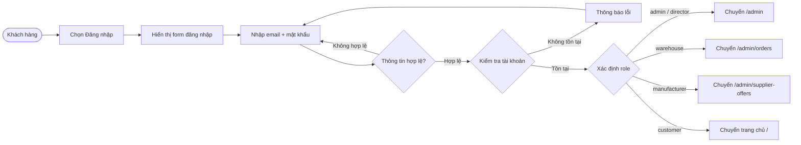

---

## 2. Sơ đồ đăng ký (Flowchart)

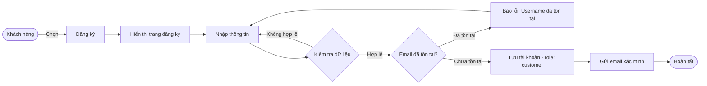

---

## 3. Sơ đồ đặt hàng — COD & BANK TRANSFER (Flowchart)

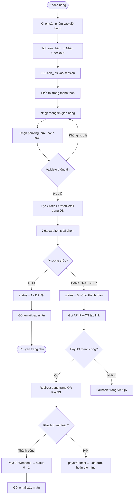

---

## 4. Sơ đồ trạng thái đơn hàng (State Diagram)

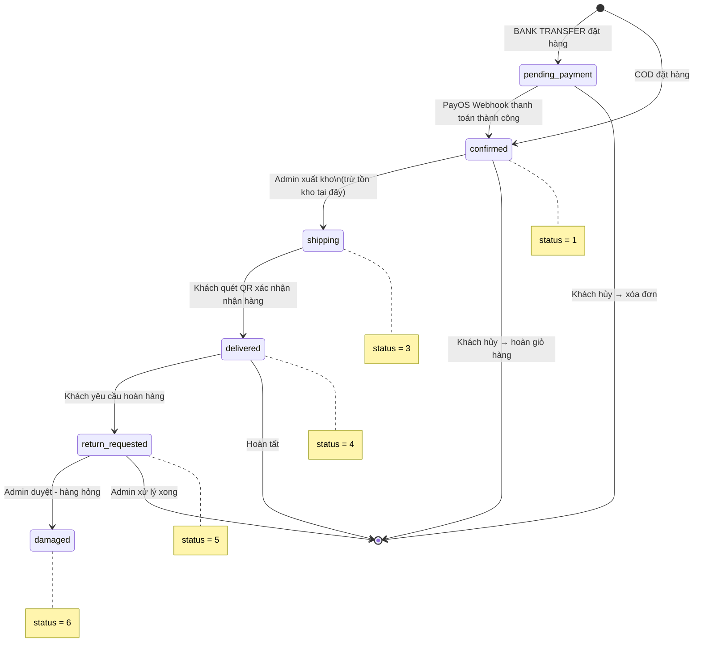

---

## 5. Sơ đồ quy trình nhập hàng (Flowchart)

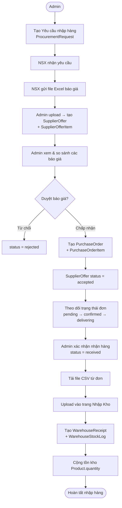

---

## 6. Sơ đồ tuần tự — Thanh toán PayOS (Sequence Diagram)

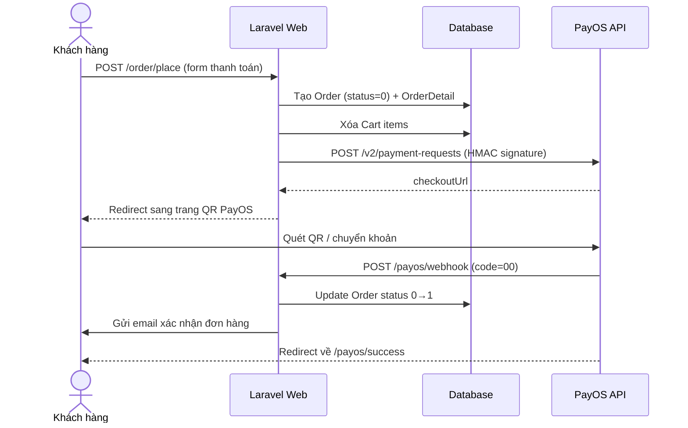

---

## 7. Sơ đồ lớp — Quan hệ Model chính (Class Diagram)

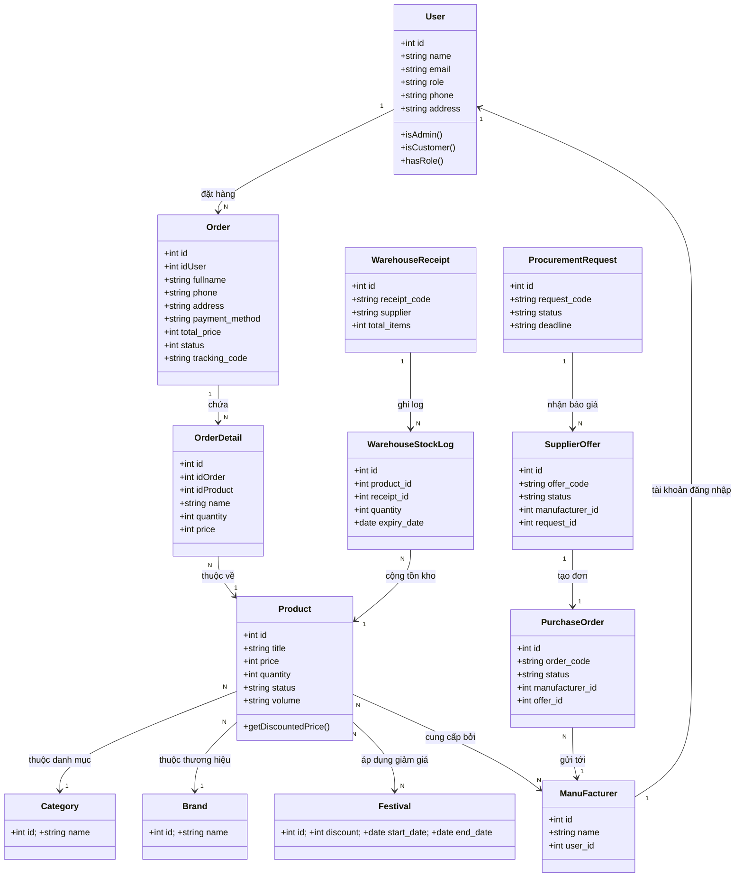

---

## 8. Sơ đồ ER — Cơ sở dữ liệu (ER Diagram)

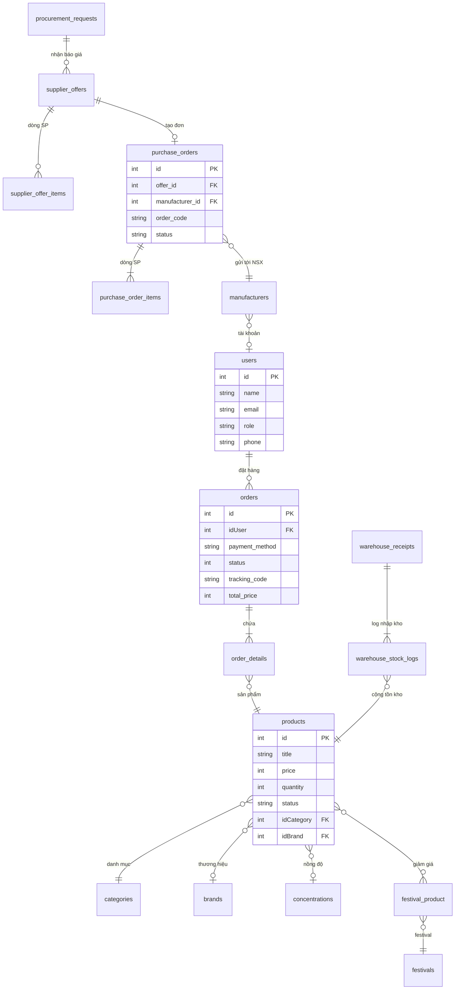


---

## 9. Quy trình quên mật khẩu (Flowchart)

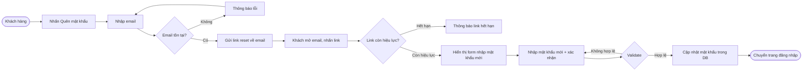

---

## 10. Quy trình cập nhật profile khách hàng (Flowchart)

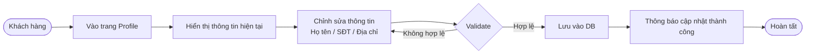

---

## 11. Quy trình quản lý địa chỉ nhận hàng (Flowchart)

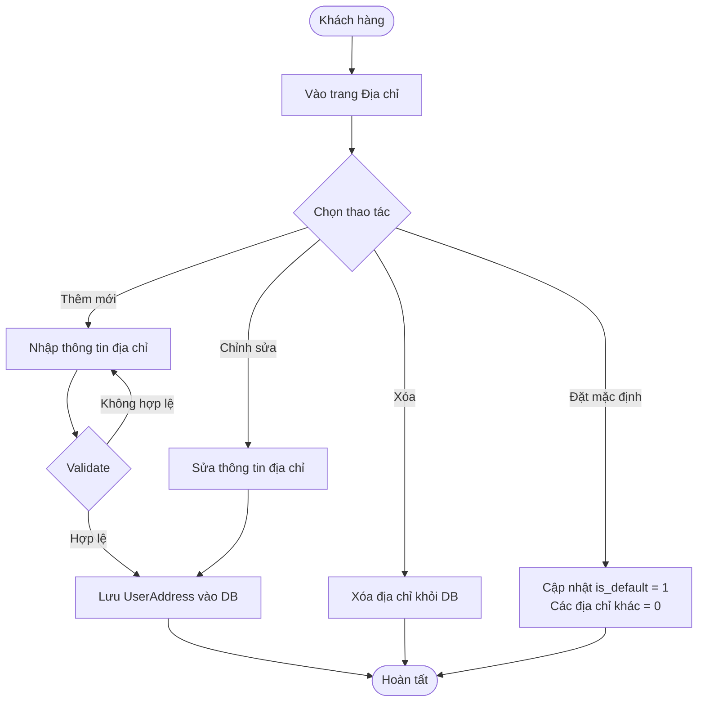

---

## 12. Quy trình tìm kiếm và lọc sản phẩm (Flowchart)

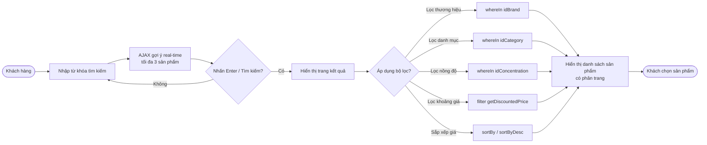

---

## 13. Quy trình quản lý giỏ hàng (Flowchart)

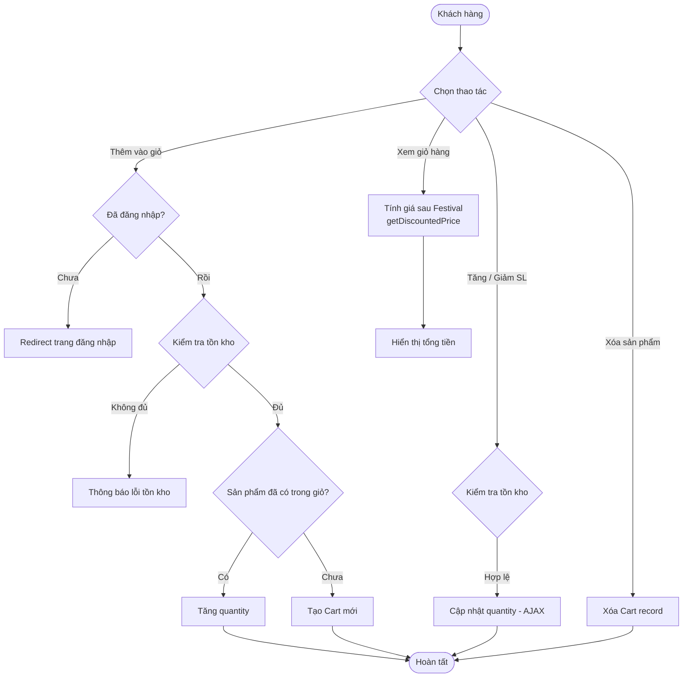

---

## 14. Quy trình hủy đơn hàng (Flowchart)

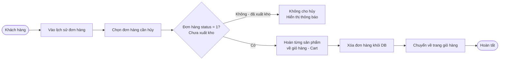

---

## 15. Quy trình xác nhận nhận hàng và hoàn hàng (Flowchart)

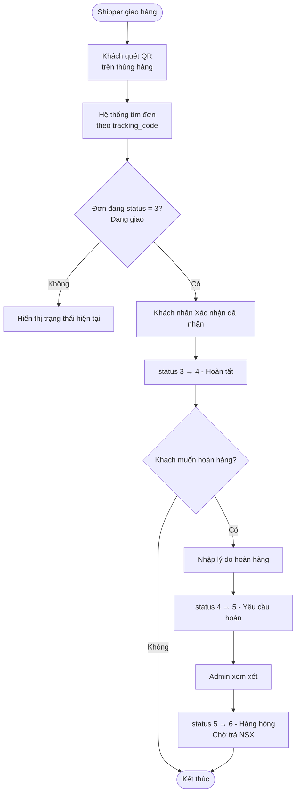

---

## 16. Quy trình xử lý đơn hàng - Admin/Warehouse (Flowchart)

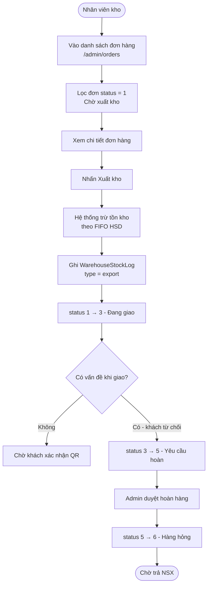

---

## 17. Quy trình nhập kho qua file CSV/Excel (Flowchart)

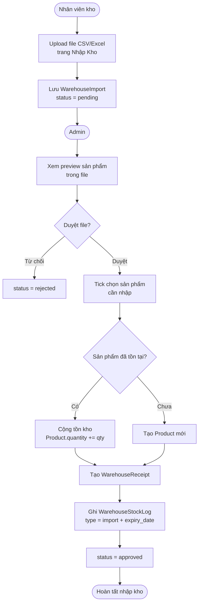

---

## 18. Quy trình quản lý sản phẩm - Admin (Flowchart)

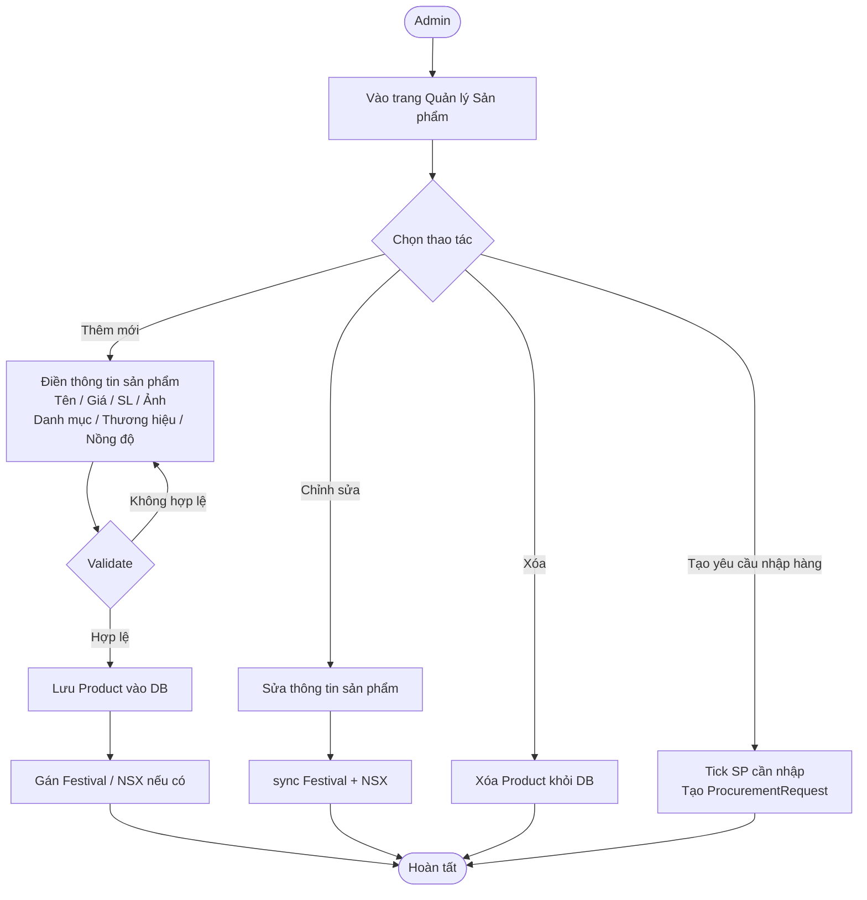

---

## 19. Quy trình quản lý khuyến mãi Festival (Flowchart)

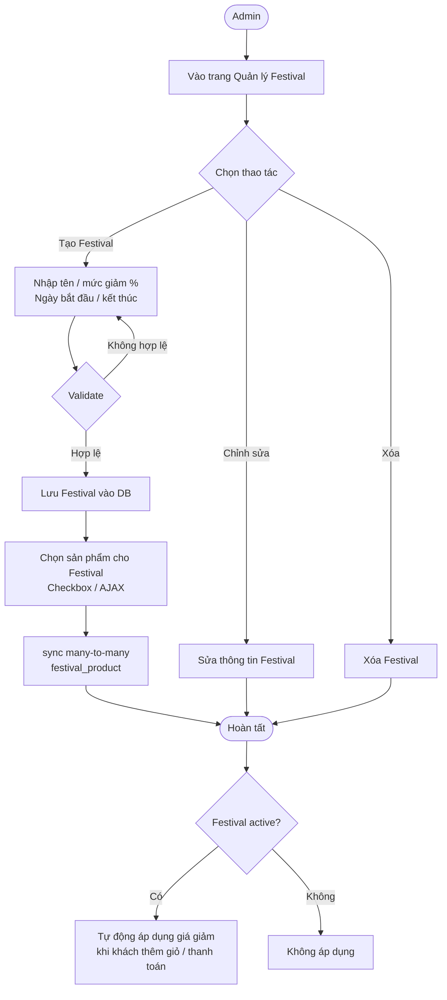

---

## 20. Quy trình quản lý người dùng và phân quyền (Flowchart)

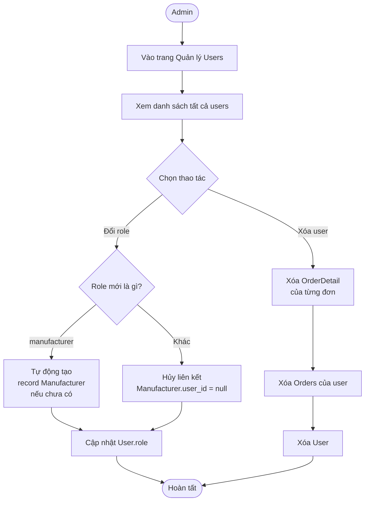

---

## 21. Quy trình quản lý nhà sản xuất (Flowchart)

```mermaid
flowchart TD
    A([Admin]) --> B[Vào trang Quản lý NSX]
    B --> C{Chọn thao tác}
    C -->|Thêm NSX| D[Nhập tên / SĐT / Địa chỉ]
    D --> E{Tạo tài khoản đăng nhập?}
    E -->|Có| F[Nhập Email + Mật khẩu\nTạo User role=manufacturer]
    F --> G[Liên kết user_id vào Manufacturer]
    E -->|Không| H[Tạo Manufacturer\nkhông có tài khoản]
    C -->|Chỉnh sửa| I[Cập nhật thông tin NSX]
    C -->|Tạo tài khoản sau| J[Nhập Email + MK\nTạo User mới\nGán user_id]
    C -->|Xóa| K[Xóa Manufacturer]
    G & H & I & J & K --> L([Hoàn tất])
```
