# Sơ đồ hệ thống — Aroma Shop
> Mở preview bằng `Ctrl + Shift + V`

---

## 👤 Khách hàng (Customer)

### 1. Đăng ký tài khoản

Mô tả:

Bước 1: Khách hàng truy cập trang chủ và chọn Đăng ký.
Bước 2: Hệ thống hiển thị trang đăng ký, khách nhập thông tin.
Bước 3: Hệ thống kiểm tra dữ liệu — nếu không hợp lệ thì yêu cầu nhập lại.
Bước 4: Hệ thống kiểm tra email đã tồn tại trong CSDL chưa:
  Đã tồn tại: Báo lỗi "Username đã tồn tại", yêu cầu nhập lại.
  Chưa tồn tại: Lưu tài khoản mới với role mặc định là `customer`.
Bước 5 (Hoàn tất): Hệ thống gửi email xác minh để kích hoạt tài khoản.

---

### 2. Đăng nhập

Mô tả:

Bước 1: Khách hàng truy cập trang web và chọn Đăng nhập.
Bước 2: Hệ thống hiển thị form nhập email và mật khẩu.
Bước 3: Khách nhập thông tin và nhấn Submit.
Bước 4: Hệ thống validate dữ liệu — nếu không hợp lệ thì yêu cầu nhập lại.
Bước 5: Hệ thống kiểm tra tài khoản trong CSDL:
  Không tồn tại: Hiển thị thông báo lỗi, yêu cầu nhập lại.
  Tồn tại: Xác định role và chuyển hướng phù hợp:
    `root` → `/admin` (Dashboard đầy đủ, không có doanh thu, có toàn quyền)
    `admin / director` → `/admin`
    `warehouse` → `/admin/orders`
    `manufacturer` → `/admin/supplier-offers`
    `customer` → Trang chủ `/`

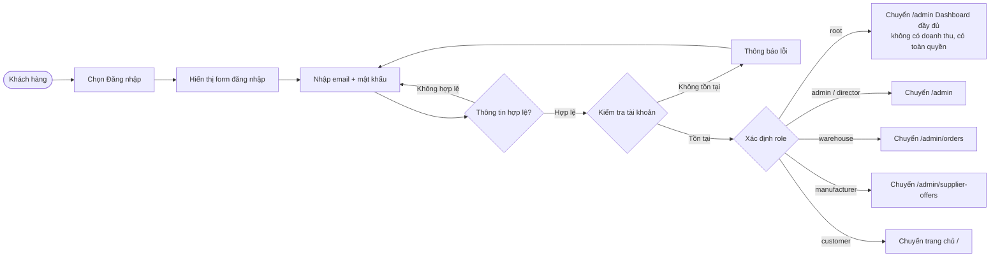

---

### 3. Quên mật khẩu

Mô tả:

Bước 1: Khách hàng nhấn "Quên mật khẩu" và nhập email.
Bước 2: Hệ thống kiểm tra email trong CSDL:
  Không tồn tại: Hiển thị thông báo lỗi, yêu cầu nhập lại.
  Tồn tại: Gửi link reset về email kèm token có thời hạn.
Bước 3: Khách mở email và nhấn vào link reset.
Bước 4: Hệ thống kiểm tra link còn hiệu lực không:
  Hết hạn: Thông báo link hết hạn.
  Còn hiệu lực: Hiển thị form nhập mật khẩu mới.
Bước 5: Khách nhập mật khẩu mới và xác nhận — hệ thống validate:
  Không hợp lệ: Yêu cầu nhập lại.
  Hợp lệ: Cập nhật mật khẩu trong DB.
Bước 6 (Hoàn tất): Hệ thống chuyển về trang đăng nhập.

---

### 4. Cập nhật profile

Mô tả:

Bước 1: Khách hàng đã đăng nhập vào trang Profile.
Bước 2: Hệ thống hiển thị thông tin cá nhân hiện tại.
Bước 3: Khách chỉnh sửa các trường muốn thay đổi: họ tên, số điện thoại, địa chỉ.
Bước 4: Hệ thống validate dữ liệu:
  Không hợp lệ: Yêu cầu sửa lại.
  Hợp lệ: Lưu vào DB.
Bước 5 (Hoàn tất): Hệ thống hiển thị thông báo cập nhật thành công.

---

### 5. Quản lý địa chỉ nhận hàng

Mô tả:

Khách hàng vào trang Địa chỉ để quản lý sổ địa chỉ giao hàng. Có 4 thao tác:

Thêm địa chỉ mới: Nhập thông tin → validate → lưu vào bảng `user_addresses`.
Chỉnh sửa: Sửa thông tin địa chỉ đã có → lưu lại.
Xóa: Xóa địa chỉ không cần nữa khỏi DB.
Đặt mặc định: Cập nhật `is_default = 1` cho địa chỉ được chọn, các địa chỉ còn lại về `0`.

> Tất cả thao tác thực hiện qua AJAX, không cần reload trang.

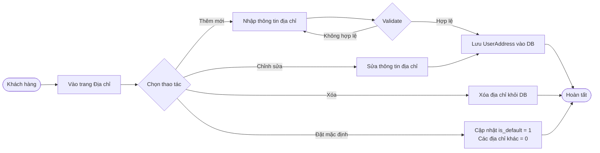

---

### 6. Tìm kiếm và lọc sản phẩm

Mô tả:

 Bước 1: Khách hàng nhập từ khóa vào ô tìm kiếm.
 Bước 2: Hệ thống hiển thị tối đa 3 sản phẩm khớp.
 Bước 3: Khách nhấn Enter hoặc nút Tìm kiếm → hệ thống chuyển sang trang kết quả.
 Bước 4: Khách có thể áp dụng thêm bộ lọc:
   Theo thương hiệu → `whereIn idBrand`
   Theo danh mục → `whereIn idCategory`
   Theo nồng độ → `whereIn idConcentration`
   Theo khoảng giá → `filter getDiscountedPrice` (tính giá sau Festival)
   Sắp xếp theo giá tăng/giảm → `sortBy / sortByDesc`
 Bước 5: Kết quả hiển thị có phân trang.

---

### 7. Quản lý giỏ hàng

Mô tả:

Khách hàng có 4 thao tác với giỏ hàng:

Thêm sản phẩm:
   Yêu cầu đăng nhập (chưa đăng nhập → redirect trang đăng nhập).
   Kiểm tra tồn kho — nếu không đủ thì thông báo lỗi.
   Sản phẩm đã có trong giỏ → tăng `quantity`. Chưa có → tạo Cart mới.
 Tăng / Giảm số lượng: Kiểm tra tồn kho rồi cập nhật qua AJAX.
 Xóa sản phẩm: Xóa record `Cart` khỏi DB.
 Xem giỏ hàng: Tính lại giá sau Festival (`getDiscountedPrice`), hiển thị tổng tiền.

> Lưu ý: Tồn kho chỉ bị trừ thực sự khi admin xuất kho, không phải khi thêm vào giỏ.

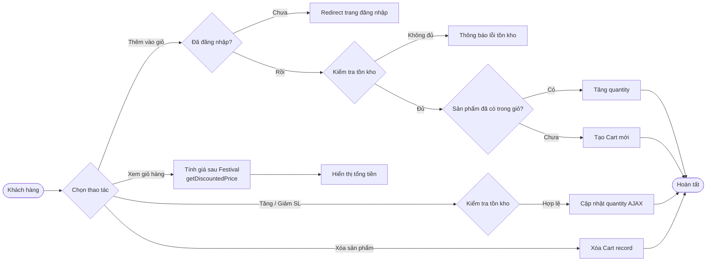

---

### 8. Đặt hàng (COD & BANK TRANSFER)

Mô tả:

Bước 1: Khách hàng chọn sản phẩm vào giỏ hàng, tick sản phẩm cần mua rồi nhấn Checkout.
Bước 2: Hệ thống lưu danh sách `cart_ids` vào session và chuyển sang trang thanh toán.
Bước 3: Khách điền thông tin giao hàng (họ tên, số điện thoại, địa chỉ) và chọn phương thức thanh toán.
Bước 4: Hệ thống validate — nếu không hợp lệ thì báo lỗi.
Bước 5: Hệ thống tạo `Order` + `OrderDetail` trong DB và xóa các sản phẩm đã chọn khỏi giỏ.
Bước 6: Xử lý theo phương thức thanh toán:

  Trường hợp 1 — COD:
  Đơn chuyển sang `status = 1` (Đã đặt).
  Hệ thống gửi email xác nhận.
  Chuyển về trang chủ.

  Trường hợp 2 — Chuyển khoản (BANK TRANSFER):
  Đơn ở `status = 0` (Chờ thanh toán).
  Hệ thống gọi API PayOS để tạo link thanh toán QR.
  Nếu PayOS thành công → redirect sang trang QR PayOS. Nếu thất bại → fallback trang VietQR.
  Sau khi khách quét QR và thanh toán thành công → PayOS webhook xác nhận → đơn chuyển `status 0 → 1` → gửi email xác nhận.
  Nếu khách hủy → xóa đơn, hoàn lại sản phẩm vào giỏ.

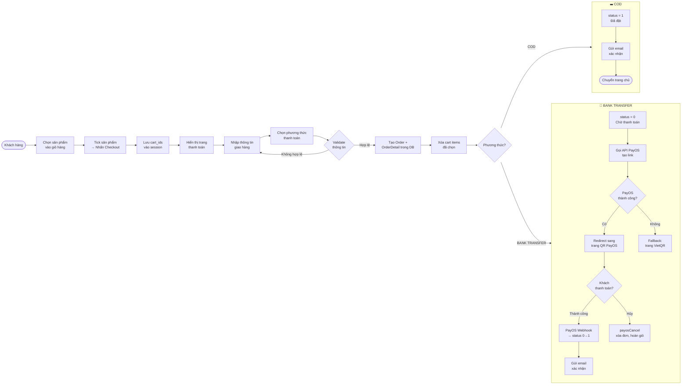

---

### 9. Hủy đơn hàng

Mô tả:

Bước 1: Khách hàng vào lịch sử đơn hàng và chọn đơn muốn hủy.
Bước 2: Hệ thống kiểm tra trạng thái đơn:
Đã xuất kho (`status ≥ 3`): Không cho hủy, hiển thị thông báo.
Chưa xuất kho (`status = 1`): Cho phép hủy.
Bước 3: Hệ thống hoàn từng sản phẩm trong đơn về giỏ hàng để khách đặt lại sau.
Bước 4: Xóa đơn hàng khỏi DB.
Bước 5 (Hoàn tất): Chuyển về trang giỏ hàng.

> Lưu ý: Tồn kho không thay đổi vì chưa bị trừ từ trước.

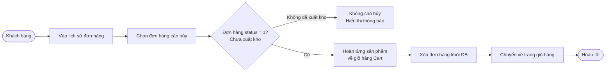

---

### 10. Xác nhận nhận hàng & hoàn hàng

Mô tả:

Bước 1: Shipper giao hàng và đề nghị khách quét mã QR in trên thùng hàng.
Bước 2: Hệ thống tìm đơn hàng theo `tracking_code` trong QR:
  Không đúng `status = 3`: Hiển thị trạng thái hiện tại, không làm gì thêm.
  Đúng `status = 3` (Đang giao): Hiển thị nút xác nhận.
Bước 3: Khách nhấn "Xác nhận đã nhận" → đơn chuyển `status 3 → 4` (Hoàn tất).
Bước 4: Nếu khách phát hiện vấn đề với hàng:
  Không hoàn: Kết thúc.
  Muốn hoàn: Khách nhập lý do → đơn chuyển `status 4 → 5` (Yêu cầu hoàn).
Bước 5: Admin xem xét và duyệt hoàn hàng → đơn chuyển `status 5 → 6` (Hàng hỏng, chờ trả NSX).

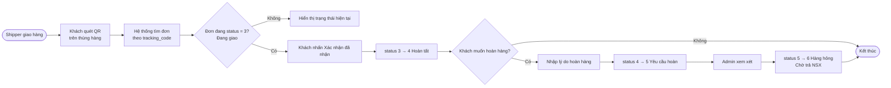

---

## 🏭 Admin & Root

### 11. Quản lý sản phẩm

Mô tả:

Admin vào trang quản lý sản phẩm, có 4 thao tác chính:

Thêm mới:
  Điền thông tin: tên, giá, số lượng, ảnh, danh mục, thương hiệu, nồng độ.
  Hệ thống validate → lưu `Product` vào DB.
  Gán Festival hoặc NSX nếu cần.
Chỉnh sửa: Cập nhật thông tin và đồng bộ lại liên kết Festival/NSX.
Xóa: Xóa sản phẩm khỏi DB.
Tạo yêu cầu nhập hàng: Tick các sản phẩm cần nhập thêm → tạo `ProcurementRequest` gửi cho NSX.

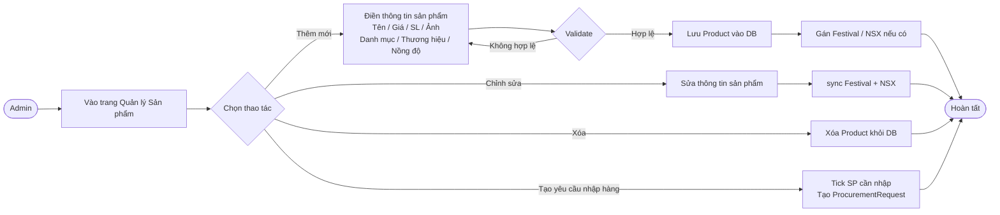

---

### 12. Quản lý khuyến mãi Festival

Mô tả:

Admin vào trang quản lý Festival để tạo và quản lý các chương trình khuyến mãi:

Tạo Festival:
  Nhập tên festival, mức giảm giá (%), ngày bắt đầu và kết thúc.
  Hệ thống validate → lưu vào DB.
  Admin chọn sản phẩm tham gia qua checkbox → hệ thống sync quan hệ nhiều-nhiều trong bảng `festival_product`.
Chỉnh sửa: Cập nhật thông tin Festival.
Xóa: Xóa Festival khỏi DB.

Sau khi hoàn tất, hệ thống kiểm tra Festival có đang active không:
Active (trong khoảng ngày): Tự động áp dụng giá giảm khi khách thêm vào giỏ / thanh toán thông qua `getDiscountedPrice()`.
Không active: Không áp dụng giá giảm.

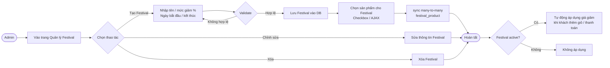

---

### 13. Xử lý đơn hàng (Admin/Warehouse)

Mô tả:

Bước 1: Nhân viên kho vào trang danh sách đơn hàng `/admin/orders`, lọc các đơn `status = 1` (Chờ xuất kho).
Bước 2: Xem chi tiết đơn hàng.
Bước 3: Nhân viên nhấn "Xuất kho":
  Hệ thống tự động trừ tồn kho theo nguyên tắc FIFO (hàng nhập trước, HSD gần nhất xuất trước).
  Ghi `WarehouseStockLog` với `type = export`.
  Đơn chuyển `status 1 → 3` (Đang giao).
Bước 4: Theo dõi quá trình giao hàng:
  Giao thành công: Chờ khách quét QR xác nhận nhận hàng (chuyển sang quy trình 10).
  Gặp vấn đề / khách từ chối: Đơn chuyển `status 3 → 5` (Yêu cầu hoàn) → Admin duyệt hoàn → `status 5 → 6` (Hàng hỏng, chờ trả NSX).

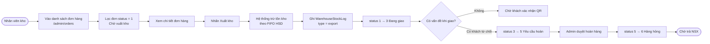

---

### 14. Nhập kho qua file CSV/Excel

Mô tả:

Bước 1: Nhân viên kho upload file CSV/Excel chứa danh sách sản phẩm cần nhập.
Bước 2: Hệ thống lưu `WarehouseImport` với `status = pending`.
Bước 3: Admin vào xem preview nội dung file và kiểm tra thông tin.
Bước 4: Admin quyết định:
  Từ chối: File chuyển sang `status = rejected`.
  Duyệt: Admin tick chọn sản phẩm cần nhập:
    Sản phẩm đã có → cộng thêm tồn kho (`Product.quantity += qty`).
    Chưa có → tạo `Product` mới.
Bước 5: Hệ thống tạo `WarehouseReceipt` và ghi `WarehouseStockLog` với `type = import` kèm ngày hết hạn (HSD) của lô hàng.
Bước 6 (Hoàn tất): File chuyển sang `status = approved`.

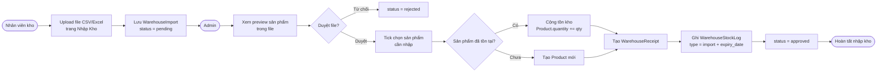

---

### 15. Quy trình nhập hàng từ NSX

Mô tả:

Giai đoạn 1 — Báo giá & Đặt hàng:
Bước 1: Admin tạo `ProcurementRequest` để thông báo nhu cầu nhập hàng cho các NSX.
Bước 2: NSX nhận yêu cầu, chuẩn bị báo giá và upload file Excel lên hệ thống → hệ thống tạo `SupplierOffer`.
Bước 3: Admin xem và so sánh các báo giá từ nhiều NSX:
  Từ chối: Báo giá chuyển sang `status = rejected`.
  Chấp nhận: Tạo `PurchaseOrder` đặt hàng chính thức → `SupplierOffer.status = accepted`.
Bước 4: Theo dõi tiến trình đơn đặt hàng: `pending → confirmed → delivering → received`.

Giai đoạn 2 — Nhập kho:
Bước 5: Khi nhận hàng thực tế, admin tải file CSV từ đơn đặt hàng và upload vào trang Nhập Kho.
Bước 6: Hệ thống tạo `WarehouseReceipt` + `WarehouseStockLog`, cộng tồn kho (`Product.quantity`) với ngày hết hạn của từng lô.
Bước 7 (Hoàn tất): Hàng vào kho, tồn kho được cập nhật.

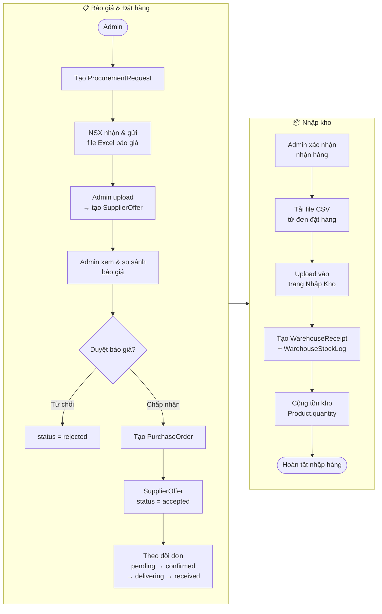

---

### 16. Quản lý người dùng & phân quyền

Mô tả:

Admin hoặc root vào trang quản lý Users để xem danh sách tất cả tài khoản. Có 2 thao tác chính:

Đổi role:
  `root` → Cấp toàn quyền, xem hết mọi chức năng, không có doanh thu, bị ghi log mọi thao tác.
  `manufacturer` → Hệ thống tự động tạo record trong bảng `manufacturers` nếu chưa có.
  Role khác → Hủy liên kết manufacturer (giữ record NSX nhưng xóa `user_id`).
  Tất cả trường hợp đều cập nhật `User.role` trong DB.

Xóa user:
  Xóa toàn bộ đơn hàng và dữ liệu liên quan của user đó.
  Sau đó xóa tài khoản.

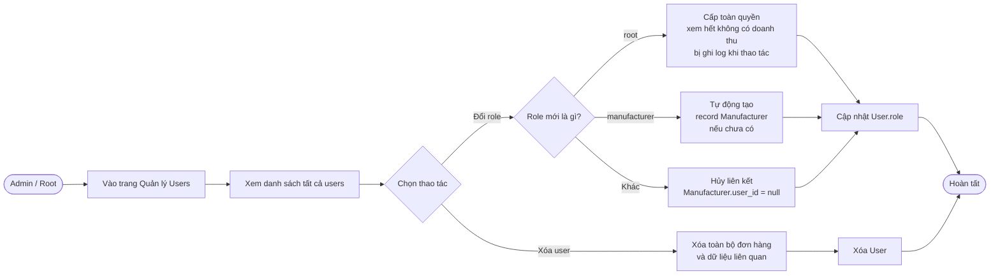

---

### 17. Quản lý nhà sản xuất

Mô tả:

Bước 1: NSX tự đăng ký tài khoản bình thường trên hệ thống.
Bước 2: Admin vào trang quản lý Users, tìm tài khoản đó và đổi role thành `manufacturer`.
Bước 3: Hệ thống tự động tạo record `Manufacturer` liên kết với tài khoản qua `user_id`.
Bước 4: Admin có thể thao tác thêm trong trang Quản lý NSX:
  Cập nhật thông tin: Sửa tên, SĐT, địa chỉ.
  Xóa NSX: Xóa record `Manufacturer`.
  Bỏ role manufacturer: Liên kết `user_id` bị hủy nhưng record NSX vẫn được giữ lại.

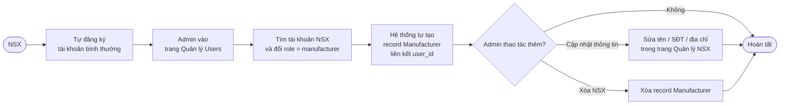

---

## 🔍 Root & Director

### 18. Ghi log Root & Director theo dõi

Mô tả:

Tự động ghi log: Mọi thao tác của tài khoản `root` đều được ghi lại: tên, email, hành động, thời gian — lưu vào bảng `root_activity_logs`.
Director xem log: Vào menu "Lịch sử hoạt động Root":
  Lọc theo ngày hoặc tìm theo tên/email để thu hẹp kết quả.
  Hoặc xem toàn bộ log không lọc.

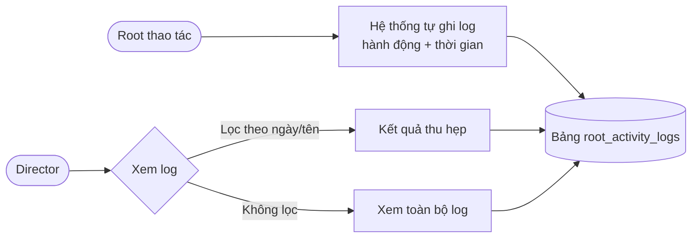

---

## 📊 Tổng hợp phân quyền

### Bảng phân quyền theo role

| Tính năng | root | admin | director | warehouse | manufacturer | customer |
|-----------|:----:|:-----:|:--------:|:---------:|:------------:|:--------:|
| Dashboard tổng quan | ✅ | ✅ | ❌ | ❌ | ❌ | ❌ |
| Xem doanh thu | ❌ | ❌ | ✅ | ❌ | ❌ | ❌ |
| Quản lý sản phẩm | ✅ | ✅ | ❌ | ❌ | ❌ | ❌ |
| Order & Kho | ✅ | ✅ | ❌ | ✅ | ❌ | ❌ |
| Nhập kho | ✅ | ✅ (duyệt) | ❌ | ✅ (upload) | ❌ | ❌ |
| Báo giá NSX | ✅ | ✅ | ❌ | ❌ | ✅ (upload) | ❌ |
| Đơn đặt hàng NSX | ✅ | ✅ | ❌ | ✅ (nhận hàng) | ✅ | ❌ |
| Yêu cầu nhập hàng | ✅ | ✅ | ❌ | ❌ | ✅ | ❌ |
| Quản lý User | ✅ | ✅ | ❌ | ❌ | ❌ | ❌ |
| Contact/Footer/Title | ✅ | ✅ | ❌ | ❌ | ❌ | ❌ |
| Xem Activity Log root | ❌ | ❌ | ✅ | ❌ | ❌ | ❌ |
| Bị ghi Activity Log | ✅ | ❌ | ❌ | ❌ | ❌ | ❌ |
