# Sơ đồ hệ thống — Aroma Shop
> Mở preview bằng `Ctrl + Shift + V`

---

## 👤 KHÁCH HÀNG (Customer)

### 1. Đăng ký tài khoản

Bước 1: Vào trang đăng ký, nhập: họ tên, email, SĐT, địa chỉ, mật khẩu.
Bước 2: Validate — tên (required, max 255), email (required, unique), SĐT (required, unique, regex `^0[0-9]{9,10}$`), mật khẩu (min 8, confirmed).
Bước 3: Email/SĐT trùng → báo lỗi validation. Hợp lệ → tạo User `role=customer`.
Bước 4: Redirect `/email/verify` — phải xác minh email trước khi dùng tính năng cần auth.

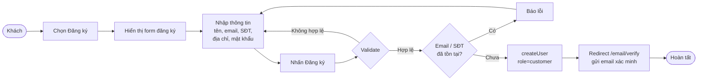

---

### 2. Đăng nhập

Bước 1: Nhập email + mật khẩu.
Bước 2: Laravel check credentials — sai → báo lỗi.
Bước 3: Check `is_active` — false → logout ngay, báo tài khoản bị vô hiệu hóa.
Bước 4: Redirect theo role:
- `root` / `admin` / `director` → `/admin`
- `warehouse` → `/admin/orders`
- `manufacturer` → `/admin/supplier-offers`
- `customer` → `/`

```mermaid
flowchart LR
    A([Người dùng]) --> B[Chọn Đăng nhập]
    B --> C[Hiển thị form đăng nhập]
    C --> D[Nhập email + mật khẩu]
    D --> E[Nhấn Đăng nhập]
    E --> F{Validate\ncredentials?}
    F -->|Sai| G[Báo lỗi]
    G --> D
    F -->|Đúng| H{Tài khoản\ntồn tại?}
    H -->|Không| I[Báo lỗi]
    I --> D
    H -->|Có| J{is_active?}
    J -->|false| K[Logout\nBáo vô hiệu hóa]
    J -->|true| L{Xác định role}
    L -->|root/admin/director| M[/admin]
    L -->|warehouse| N[/admin/orders]
    L -->|manufacturer| O[/admin/supplier-offers]
    L -->|customer| P[/]
```

---

### 2b. Quên mật khẩu

Bước 1: Từ trang đăng nhập → bấm "Quên mật khẩu".
Bước 2: Nhập email → hệ thống kiểm tra email có tồn tại không.
Bước 3: Tồn tại → gửi link reset qua email (token có thời hạn).
Bước 4: Người dùng bấm link → nhập mật khẩu mới (min 8, confirmed).
Bước 5: Hash mật khẩu + lưu, **không tự đăng nhập** → redirect về `/login` với thông báo thành công.

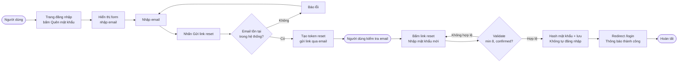

---

### 3. Cập nhật hồ sơ cá nhân

Bước 1: Đăng nhập → vào trang Profile.
Bước 2: Sửa tên, email, SĐT, địa chỉ, mật khẩu mới (tuỳ chọn).
Bước 3: Validate — email unique trừ chính mình, mật khẩu min 8 nếu có điền.
Bước 4: Lưu. Mật khẩu chỉ hash và cập nhật khi người dùng điền vào ô password.

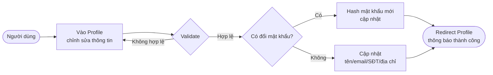

---

### 4. Giỏ hàng

**Thêm vào giỏ:**
Bước 1: Cần đăng nhập. SP phải tồn tại, số lượng 1–100.
Bước 2: Kiểm tra tồn kho — không đủ → báo lỗi.
Bước 3: SP đã có trong giỏ → tăng quantity. Chưa có → tạo mới.

**Trang giỏ hàng:**
Giá hiển thị = giá sau giảm festival (`getDiscountedPrice()`). Tồn kho KHÔNG trừ khi thêm giỏ.

**Tăng/giảm số lượng (AJAX):** Không vượt tồn kho hiện tại.

**Xóa:** Xóa 1 item khỏi giỏ.

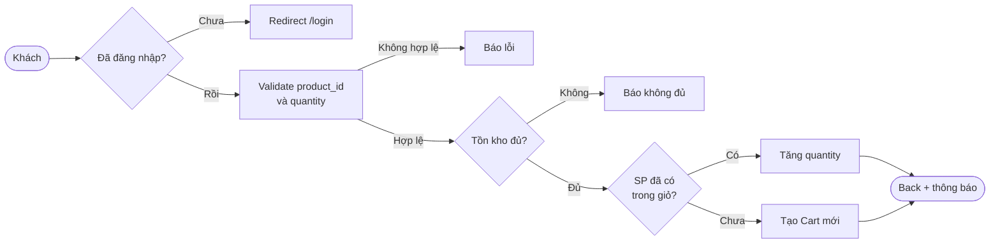

---

### 5. Đặt hàng (COD & BANK TRANSFER)

**Luồng:**
1. Tick SP trong giỏ → Checkout → `cart_ids` lưu session.
2. Nhập thông tin giao hàng + chọn phương thức.
3. Validate: họ tên, SĐT `^[0-9]{9,11}$`, địa chỉ, phương thức `in:COD,BANK TRANSFER`.
4. Tạo `Order` + `OrderDetail`, xóa cart items. **Tồn kho KHÔNG trừ ở đây.**

**COD — status=1:**
- Tạo link PayOS (nếu cấu hình), gửi email xác nhận kèm link nâng cấp chuyển khoản.
- Bấm Hủy PayOS → về trang chủ, đơn COD vẫn còn.
- Vào lịch sử → "Thanh toán online" → tạo link PayOS mới (`repay()`).
- Thanh toán OK → webhook → `payment_method → BANK TRANSFER`, status vẫn 1, gửi email.

**BANK TRANSFER — status=0:**
- Gọi API PayOS → redirect QR.
- Thanh toán OK → webhook → `status 0→1`, gửi email.
- Bấm Hủy → `payosCancel()` → xóa Order + OrderDetail, hoàn sản phẩm về giỏ.
- PayOS chưa cấu hình → fallback trang VietQR.

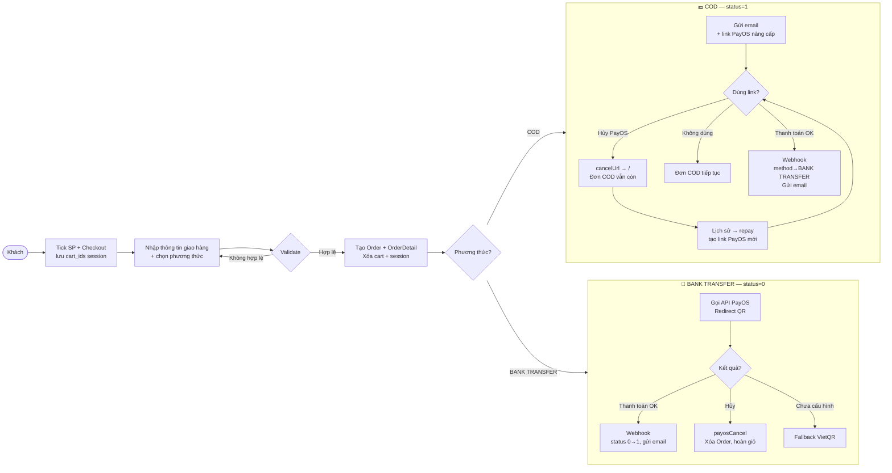

---

### 6. Hủy đơn hàng (khách tự hủy)

Chỉ hủy được khi `status = 1` (chưa xuất kho). Phải nhập lý do (min 5 ký tự).
- `status → -1`, lý do nối vào `note`.
- Sản phẩm hoàn lại vào giỏ hàng.

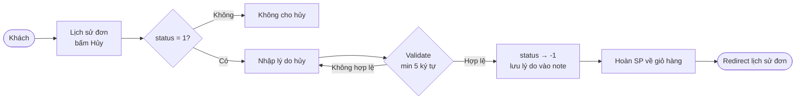

---

### 7. Xác nhận nhận hàng & Yêu cầu hoàn hàng

**Xác nhận nhận hàng:**
Admin xuất kho → `status=3` + in QR `tracking_code` dán lên thùng.
Khách quét QR → trang public (không cần login). Bấm xác nhận → `status 3→4`.

**Yêu cầu hoàn hàng:**
Chỉ được yêu cầu khi `status=4` và trong vòng 3 ngày kể từ lúc giao.
Nhập lý do (min 5 ký tự) → `status → 5` (Yêu cầu hoàn), lý do nối vào `note`.

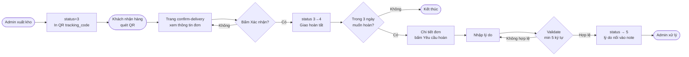

---

### 9. Xem trang sản phẩm

- Trang chủ: lọc theo nồng độ, hiển thị festival active (SP nhiều festival → chỉ hiện ở festival discount cao nhất, tối đa 6 SP).
- Trang danh mục / thương hiệu: lọc brand, concentration, danh mục, giá (filter SAU get vì giá có festival), sort.
- Chi tiết SP: load comment + concentration.
- Tìm kiếm live (AJAX, max 3 gợi ý), trang kết quả (filter + sort đầy đủ).
- Trang festival: lọc theo discount cao nhất, sort.

---

### 10. Quản lý địa chỉ nhận hàng

Tất cả thao tác qua **AJAX** (JSON), không reload trang. Yêu cầu đăng nhập.

- **Xem danh sách:** Lấy tất cả địa chỉ của user, sắp xếp: mặc định trước, mới nhất sau. Nếu bảng trống → tự seed 1 địa chỉ từ `user.address` / `user.phone`.
- **Thêm mới:** Validate tên (max 100), SĐT (max 20), địa chỉ (max 255). Nếu tick "mặc định" → bỏ cờ tất cả địa chỉ cũ trước.
- **Cập nhật:** Chỉ cập nhật địa chỉ của chính mình (`idUser`). Logic mặc định giống thêm mới.
- **Xóa:** Chỉ xóa địa chỉ của chính mình. Nếu xóa địa chỉ mặc định → tự động set địa chỉ mới nhất còn lại làm mặc định.
- **Đặt mặc định:** Bỏ cờ tất cả → set cờ cho địa chỉ được chọn.

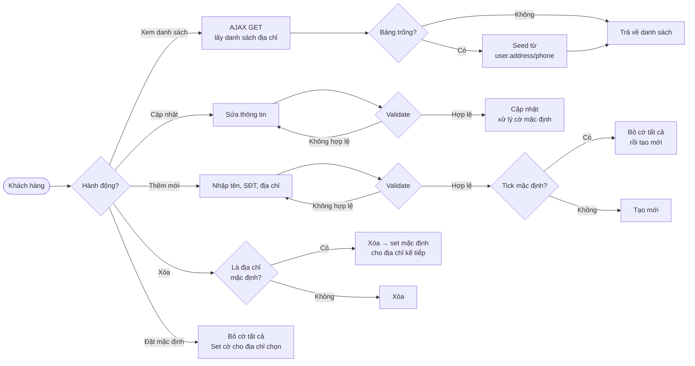

---

### 11. Tìm kiếm và lọc sản phẩm

**Gợi ý tìm kiếm (AJAX):** Nhập từ khóa → live search → trả về tối đa 3 SP (title, image, price). Chỉ lấy SP `status=1` thuộc danh mục/brand/concentration active.

**Trang kết quả tìm kiếm:**
- Lọc: brand, concentration, danh mục (checkbox), giá min/max.
- Lưu ý: filter giá thực hiện SAU `get()` vì giá có thể bị giảm bởi festival (`getDiscountedPrice()`).
- Sort: giá tăng, giá giảm, mặc định (mới nhất).
- Phân trang thủ công (manual paginate) để giữ đúng tổng sau filter.

**Trang danh mục / thương hiệu / festival:** Luồng tương tự nhưng bắt đầu từ điều kiện lọc cố định (idCategory / idBrand / festival_id).

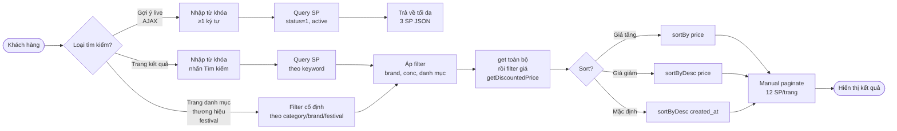

---

## 🛡️ ADMIN / WAREHOUSE / DIRECTOR

### 12. Quản lý đơn hàng (admin)

**Luồng trạng thái:**
`0` Chờ PayOS → `1` Đặt / Đã thanh toán → `3` Xuất kho đang giao → `4` Giao thành công → `5` Yêu cầu hoàn → `6` Hàng hỏng. Hủy: `-1`.

**Xuất kho (status 1→3):** Trừ tồn kho FIFO theo HSD (lô gần hết hạn trước). Ghi `WarehouseStockLog` type=export cho từng lô. Sau đó `status → 3`.

**Hoàn hàng:** Chỉ với `status=3` hoặc `5`. Dù hàng nguyên vẹn hay hỏng → đều chuyển sang `status=6` (hàng hỏng, chờ trả NSX, KHÔNG nhập lại kho).

**Quyền truy cập:** `warehouse` xem đơn thường. `admin` xem danh sách hàng hỏng. `director` / `root` xem tất cả.

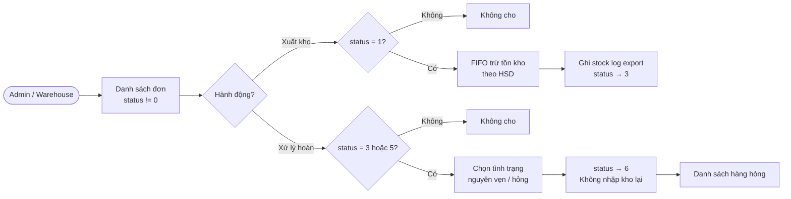

---

### 11. Quản lý người dùng (admin)

- Danh sách user, tìm kiếm theo email, phân trang 20.
- Đổi role: admin không tự đổi role mình; phân quyền gán role theo operator:
  - `root` → gán mọi role
  - `admin` → gán warehouse, manufacturer, customer, admin (không gán director/root)
  - `director` → chỉ gán admin
- Toggle `is_active` (tắt/bật tài khoản, không xóa dữ liệu):
  - `director` → toggle customer, warehouse, manufacturer
  - `admin` → toggle customer, warehouse, manufacturer, admin
  - `root` → toggle thêm director

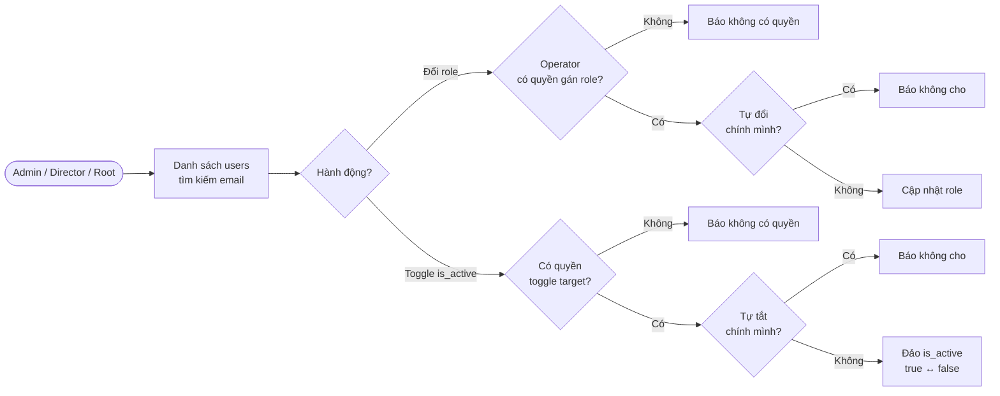

---

### 11b. Quản lý người dùng & phân quyền (chi tiết)

**Danh sách & tìm kiếm:**
- Hiển thị tất cả users, phân trang 20 dòng. Tìm kiếm theo email (LIKE).
- Quyền truy cập trang: `admin`, `director`, `root`.

**Đổi role (`update()`):**

| Operator | Được phép gán role |
|----------|--------------------|
| `root` | `admin`, `warehouse`, `manufacturer`, `customer`, `director`, `root` |
| `admin` | `warehouse`, `manufacturer`, `customer`, `admin` (không gán `director`, `root`) |
| `director` | chỉ `admin` |

Ràng buộc: không ai được tự đổi role của chính mình.

**Toggle is_active (`toggleStatus()`):**

| Operator | Được toggle tài khoản có role |
|----------|-------------------------------|
| `director` | `customer`, `warehouse`, `manufacturer` |
| `admin` | `customer`, `warehouse`, `manufacturer`, `admin` |
| `root` | `customer`, `warehouse`, `manufacturer`, `admin`, `director` |

Ràng buộc: không ai được tự tắt tài khoản của chính mình. Toggle không xóa dữ liệu.

**Redirect sau đăng nhập theo role:**

| Role | Redirect về |
|------|-------------|
| `root` | `/admin` |
| `admin` | `/admin` |
| `director` | `/admin` |
| `warehouse` | `/admin/orders` |
| `manufacturer` | `/admin/supplier-offers` |
| `customer` | `/` |

**is_active check:** Kiểm tra ngay sau khi credentials đúng — nếu `is_active = false` → logout ngay, trả lỗi, không vào được hệ thống.

```mermaid
flowchart LR
    subgraph DANHSACH ["👥 Danh sách & tìm kiếm"]
        A([Admin / Director / Root]) --> B[Vào /admin/user\nTìm kiếm theo email]
        B --> C[Danh sách users\nphân trang 20]
    end

    subgraph DOIROLE ["🔑 Đổi role"]
        C --> D{Bấm đổi role\ncho user X}
        D --> E{X là chính mình?}
        E -->|Có| F[Báo lỗi\nKhông cho]
        E -->|Không| G{Operator có quyền\ngán role mới?}
        G -->|Không| H[Báo lỗi\nKhông đủ quyền]
        G -->|Có| I[Cập nhật role\nLưu vào DB]
    end

    subgraph TOGGLE ["🔒 Toggle is_active"]
        C --> J{Bấm tắt/bật\ntài khoản user X}
        J --> K{X là chính mình?}
        K -->|Có| L[Báo lỗi\nKhông cho]
        K -->|Không| M{Operator có quyền\ntoggle role của X?}
        M -->|Không| N[Báo lỗi\nKhông đủ quyền]
        M -->|Có| O[Đảo is_active\ntrue ↔ false]
        O --> P{is_active\nmới là?}
        P -->|false| Q[Tài khoản X bị khoá\nLogin bị chặn ngay]
        P -->|true| R[Tài khoản X được mở]
    end

    subgraph LOGIN ["🚀 Redirect sau login"]
        S([User đăng nhập]) --> T{Credentials đúng?}
        T -->|Sai| U[Báo lỗi]
        T -->|Đúng| V{is_active?}
        V -->|false| W[Logout ngay\nBáo vô hiệu hóa]
        V -->|true| X{Role?}
        X -->|root / admin / director| Y[/admin]
        X -->|warehouse| Z[/admin/orders]
        X -->|manufacturer| AA[/admin/supplier-offers]
        X -->|customer| AB[/]
    end
```

**Ma trận đổi role chi tiết:**

```
          ┌──────────────────────────────────────────────────────┐
          │           Role ĐƯỢC PHÉP GÁN (target)               │
Operator  │ customer  warehouse  manufacturer  admin  director  root │
──────────┼──────────────────────────────────────────────────────┤
root      │    ✅        ✅           ✅          ✅      ✅       ✅  │
admin     │    ✅        ✅           ✅          ✅      ❌       ❌  │
director  │    ❌        ❌           ❌          ✅      ❌       ❌  │
──────────┴──────────────────────────────────────────────────────┘

          ┌──────────────────────────────────────────────┐
          │         Role ĐƯỢC PHÉP TOGGLE (target)       │
Operator  │ customer  warehouse  manufacturer  admin  director │
──────────┼──────────────────────────────────────────────┤
root      │    ✅        ✅           ✅          ✅      ✅     │
admin     │    ✅        ✅           ✅          ✅      ❌     │
director  │    ✅        ✅           ✅          ❌      ❌     │
──────────┴──────────────────────────────────────────────┘
```

---

### 12. Quản lý sản phẩm (admin)

- CRUD: tạo, sửa, xóa sản phẩm. Gán festival (many-to-many) và NSX (many-to-many).
- Sửa: `sync()` lại festival và manufacturer.
- Tạo yêu cầu nhập hàng: tick SP từ danh sách → tạo `ProcurementRequest` (status=open) → NSX thấy và chào giá.
- Gợi ý tìm kiếm AJAX (max 5 SP).
- Danh sách hiển thị badge bán nhanh/chậm, HSD gần nhất.

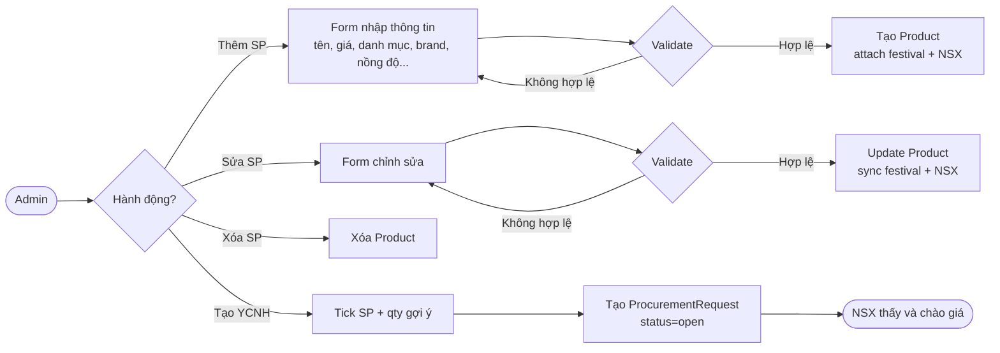

---

### 13. Quản lý kho (admin / warehouse)

**Tab 1 — Sản phẩm bán chậm:** tỷ lệ bán/nhập ≤ 20% sau 30 ngày.

**Tab 2 — Lịch sử biến động tồn kho:** log import/export theo sản phẩm.

**Tab 3 — Phiếu nhập kho:** danh sách `WarehouseReceipt`.

**Tab HSD:** cảnh báo lô hàng sắp hết hạn trong 730 ngày. Có thể attach SP vào festival ngay từ đây.

**Luồng upload file nhập kho:**
1. NV kho upload file CSV/Excel (`pending`) → validate: header chuẩn, HSD bắt buộc, định dạng YYYY-MM-DD.
2. Admin xem preview file → tick chọn SP → Duyệt hoặc Từ chối.
3. Duyệt → cộng tồn kho, tạo `WarehouseReceipt` + `WarehouseStockLog`, `status = approved`.
4. SP chưa có trong hệ thống → tạo mới (tìm/tạo brand, tìm category + concentration).
5. Từ chối → `status = rejected`, không nhập kho.

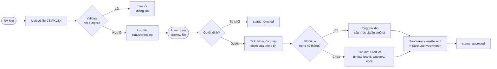

---

### 13b. Quy trình nhập kho (upload file → duyệt)

**Bước 1 — NV kho upload file:**
Upload file CSV/XLSX (max 5MB). Hệ thống validate ngay:
- Đủ 10 cột bắt buộc: `title, image, decription, unit_price, sl_order, quantity, volume, category, brand, concentration`.
- Từng dòng: tên SP không rỗng, số lượng ≥ 0, HSD bắt buộc đúng định dạng `YYYY-MM-DD`.
- Lỗi → trả về danh sách lỗi, không lưu file.

**Bước 2 — Admin duyệt:**
- Xem preview bảng sản phẩm, có thể chỉnh giá/ảnh/mô tả trước khi duyệt.
- Tick chọn SP muốn nhập → Submit duyệt.
- SP đã có → cộng `quantity`, cập nhật giá/ảnh/mô tả.
- SP chưa có → tạo mới: tìm category + concentration theo tên, brand tìm hoặc **tự tạo mới**.
- Tạo `WarehouseReceipt` (mã `PNyymddHHis`) + `WarehouseStockLog` (type=`import`, kèm HSD từng lô).
- `WarehouseImport.status = approved`, lưu `approved_items` (JSON).

**Bước 3 — Từ chối:**
- Chỉ đổi `status = rejected`, không cập nhật kho.
- File đã `approved` hoặc `rejected` không xử lý lại được.

**Xuất kho (FIFO):** Khi admin bấm "Xuất kho" trên đơn hàng → trừ tồn kho ưu tiên lô HSD gần nhất trước.

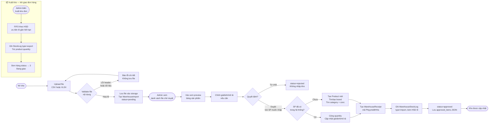

---

## 🏭 NSX — NHÀ SẢN XUẤT (Manufacturer)

### 14. Yêu cầu thu mua & Báo giá (NSX)

**Luồng tổng quát:**
Admin tạo `ProcurementRequest` (từ trang SP hoặc trang yêu cầu) → NSX thấy danh sách SP cần nhập → Admin upload file báo giá của NSX (hoặc NSX tự upload) → Admin xem + so sánh → Chọn NSX → Tạo `PurchaseOrder`.

**Chi tiết:**
1. Admin tạo `ProcurementRequest` (status=open, deadline mặc định +7 ngày).
2. Admin download file mẫu CSV → gửi cho NSX điền giá.
3. Admin upload file báo giá của NSX (CSV/XLSX) → tạo `SupplierOffer` + `SupplierOfferItem` (status=submitted).
4. Admin xem chi tiết báo giá, tick SP + điền số lượng → Tạo đơn đặt hàng.
5. Admin từ chối → `status = rejected`.

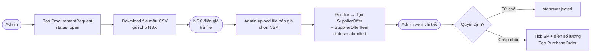

---

### 15. Đơn đặt hàng NSX (PurchaseOrder)

**Luồng trạng thái:** `pending` → `confirmed` → `delivering` → `received`. Huỷ: `cancelled`.

Khi tạo PO:
- Tính tổng tiền = sum(qty × unit_price).
- Sync SP vào danh bạ `manufacturers_product`.
- Đánh dấu `SupplierOffer.status = accepted`.
- Tự đóng `ProcurementRequest` nếu có liên kết.

**Xác nhận nhận hàng (`receive()`):** Chỉ đổi `status = received`. Tồn kho KHÔNG tự cộng — cần upload file nhập kho riêng (Luồng 13).

**Export:**
- Excel đẹp để gửi NSX.
- CSV để upload vào trang Nhập Kho (có cột `sl_order`, `quantity` trống để NV điền thực tế).

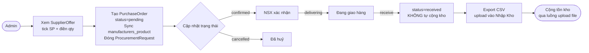

---

### 16. Quy trình nhập hàng từ NSX (end-to-end)

**Luồng tổng quát: Admin → NSX → Admin → Kho**

Đây là luồng đầy đủ từ lúc xác định cần nhập hàng đến khi tồn kho được cộng vào hệ thống. Gồm 5 giai đoạn nối tiếp nhau:

**Giai đoạn 1 — Tạo yêu cầu thu mua (ProcurementRequest):**
- Admin tick chọn SP từ trang sản phẩm → tạo `ProcurementRequest` (status=`open`).
- Mã tự sinh: `PRQ-YYYYMMDD-001`. Deadline mặc định +7 ngày.
- Admin download file mẫu CSV (10 cột chuẩn, có sẵn tên SP + qty cần) → gửi cho NSX điền giá.

**Giai đoạn 2 — NSX gửi báo giá (SupplierOffer):**
- NSX điền giá vào file CSV → trả lại cho admin.
- Admin upload file lên trang yêu cầu → hệ thống đọc file, tạo `SupplierOffer` + `SupplierOfferItem` (status=`submitted`).
- Mã báo giá: `OFR-YYYYMMDD-001`. Có thể upload nhiều báo giá từ nhiều NSX khác nhau.
- Hoặc: upload trực tiếp qua `/supplier-offers` mà không cần yêu cầu.
- Admin có thể từ chối báo giá (status=`rejected`).

**Giai đoạn 3 — Tạo đơn đặt hàng (PurchaseOrder):**
- Admin xem chi tiết báo giá → tick chọn SP muốn đặt, điền số lượng → bấm "Đặt hàng".
- Tổng tiền = `sum(qty × unit_price)`. Mã: `PO-YYYYMMDD-001`.
- Hệ thống tự động:
  - Sync SP vào `manufacturers_product` (liên kết SP ↔ NSX).
  - Đánh dấu `SupplierOffer.status = accepted`.
  - Đóng `ProcurementRequest` nếu có liên kết (status=`closed`).
- Admin cập nhật trạng thái PO: `pending → confirmed → delivering`.
- Admin export Excel đẹp để gửi lại NSX xác nhận đơn.

**Giai đoạn 4 — Xác nhận nhận hàng:**
- Khi hàng về kho: admin bấm "Xác nhận nhận hàng" → `PO.status = received`.
- **Tồn kho KHÔNG tự cộng ở bước này** — phải qua luồng upload file riêng.
- Admin export CSV từ PO (có sẵn `sl_order`, cột `quantity` và `expiry_date` để trống).

**Giai đoạn 5 — Nhập kho (WarehouseImport):**
- NV kho điền `quantity` thực tế nhận + `expiry_date` vào file CSV → upload lên trang Nhập Kho.
- Admin duyệt → cộng tồn kho + tạo `WarehouseReceipt` + `WarehouseStockLog`.
- Chi tiết xem mục **13b**.

```mermaid
flowchart LR
    subgraph GD1 ["📋 GĐ1 — Yêu cầu thu mua"]
        A([Admin]) --> B[Tick SP cần nhập\nTạo ProcurementRequest\nstatus=open]
        B --> C[Download file mẫu CSV\n10 cột chuẩn, có qty cần]
        C --> D([Gửi file cho NSX\nđiền giá])
    end

    subgraph GD2 ["💬 GĐ2 — Báo giá NSX"]
        D --> E([NSX điền unit_price\ntrả file])
        E --> F[Admin upload file báo giá\nchọn NSX]
        F --> G[Đọc file → Tạo SupplierOffer\n+ SupplierOfferItem\nstatus=submitted]
        G --> H{Admin quyết định?}
        H -->|Từ chối| I[status=rejected\nKết thúc]
        H -->|Chấp nhận\nqua GĐ3| J[ ]
    end

    subgraph GD3 ["📦 GĐ3 — Đặt hàng"]
        J --> K[Admin xem chi tiết báo giá\nTick SP + điền qty]
        K --> L[Tạo PurchaseOrder\nstatus=pending\nSync manufacturers_product\nOffer→accepted\nProcRequest→closed]
        L --> M[Export Excel\ngửi NSX xác nhận]
        M --> N{Cập nhật trạng thái PO}
        N -->|confirmed| O[NSX xác nhận]
        O -->|delivering| P[Đang giao hàng]
        N -->|cancelled| Q[Đã huỷ]
    end

    subgraph GD4 ["🚚 GĐ4 — Nhận hàng"]
        P --> R[Hàng về kho\nAdmin bấm Xác nhận nhận hàng]
        R --> S[PO.status = received\nKHÔNG tự cộng tồn kho]
        S --> T[Export CSV từ PO\ncó sl_order, trống quantity + HSD]
    end

    subgraph GD5 ["🏪 GĐ5 — Nhập kho"]
        T --> U([NV kho điền\nquantity thực + expiry_date])
        U --> V[Upload file CSV\nlên trang Nhập Kho]
        V --> W[Admin duyệt\nCộng tồn kho\nTạo WarehouseReceipt\n+ StockLog type=import]
        W --> X([Kho cập nhật\nHSD theo lô])
    end
```

**Bảng trạng thái các đối tượng sau mỗi giai đoạn:**

| Giai đoạn | ProcurementRequest | SupplierOffer | PurchaseOrder | WarehouseImport |
|-----------|-------------------|---------------|---------------|-----------------|
| Tạo yêu cầu | `open` | — | — | — |
| Upload báo giá | `open` | `submitted` | — | — |
| Tạo PO | `closed` | `accepted` | `pending` | — |
| Xác nhận giao | `closed` | `accepted` | `delivering` | — |
| Nhận hàng | `closed` | `accepted` | `received` | `pending` |
| Duyệt nhập kho | `closed` | `accepted` | `received` | `approved` |

---

### 17. Quy trình ghi log Root & Director theo dõi

**Cơ chế ghi log tự động:**

Middleware `LogRootActivity` được đăng ký trên toàn bộ route `/admin`. Mọi request của tài khoản `root` đều bị bắt sau khi xử lý xong (`$next` chạy trước → chỉ ghi log khi request thành công, tránh ghi log lỗi 500).

**Luồng ghi log:**
1. Request vào `/admin` → middleware cho đi qua (`$next($request)`) trước.
2. Sau khi response được tạo → kiểm tra `Auth::user()->role === 'root'`.
3. Nếu đúng → `resolveAction()`: match `METHOD + /url/pattern` với bảng `actionMap` (40+ entry).
4. Pattern `{id}` trong map → khớp với số thực trong URL → thay vào mô tả (VD: `Xóa user #5`).
5. Không khớp pattern nào nhưng là non-GET request vào `/admin` → fallback: ghi `"METHOD /path"`.
6. INSERT vào `root_activity_logs`: `user_id`, `user_name`, `user_email` (snapshot — không join), `action`, `created_at`.
7. Toàn bộ bọc `try-catch` → lỗi DB không crash request chính.

**Dữ liệu ghi vào log:**

| Cột | Ý nghĩa |
|-----|---------|
| `user_id` | ID tài khoản root |
| `user_name` | Tên tại thời điểm thao tác (snapshot) |
| `user_email` | Email tại thời điểm thao tác (snapshot) |
| `action` | Mô tả tiếng Việt, VD: "Duyệt nhập kho #12" |
| `created_at` | Thời điểm thao tác (set thủ công, không dùng Eloquent timestamps) |

**Director xem log:**
- Route: `GET /admin/activity-log` — chỉ `director` vào được (`middleware('role:director')`).
- **Root KHÔNG xem được log của chính mình** (tránh xóa/sửa dấu vết).
- Filter: theo ngày (`whereDate`) + tìm kiếm theo tên/email (LIKE).
- Phân trang 50 dòng/trang, giữ query string khi chuyển trang.

```mermaid
flowchart LR
    subgraph MIDDLEWARE ["⚙️ Middleware — Tự động ghi log"]
        A([Root thực hiện\nbất kỳ thao tác /admin]) --> B[Request vào /admin]
        B --> C[LogRootActivity\ncho request đi qua trước]
        C --> D[Controller xử lý\ntrả Response]
        D --> E{user.role\n= root?}
        E -->|Không| F[Không ghi log\ntrả response bình thường]
        E -->|Có| G[resolveAction\nmatch METHOD + URL]
        G --> H{Khớp actionMap?}
        H -->|Có| I[Thay {id} → số thực\nVD: Xóa user 5]
        H -->|Không + non-GET| J[Fallback: ghi\nMETHOD /path]
        H -->|GET không khớp| K[Bỏ qua\nkhông ghi]
        I --> L[INSERT root_activity_logs\nsnapshot name + email]
        J --> L
        L --> M{DB lỗi?}
        M -->|Có| N[Bắt lỗi\nkhông crash request]
        M -->|Không| O([Response trả về user])
        N --> O
    end

    subgraph DIRECTOR ["👁️ Director xem log"]
        P([Director]) --> Q[GET /admin/activity-log\nMiddleware role:director chặn root]
        Q --> R[Filter theo ngày\nvà hoặc tìm tên/email]
        R --> S[Query root_activity_logs\northerBy created_at DESC]
        S --> T[Phân trang 50 dòng\ngiữ query string]
        T --> U([Hiển thị bảng log\nai làm gì lúc nào])
    end
```

**Ví dụ các action được ghi:**

| Thao tác root | Action ghi vào log |
|---------------|--------------------|
| `GET /admin` | Xem dashboard |
| `POST /admin/orders/12/update-status` | Cập nhật trạng thái đơn hàng #12 |
| `POST /admin/warehouse/imports/5/approve` | Duyệt nhập kho #5 |
| `DELETE /admin/product/8` | Xóa sản phẩm #8 |
| `POST /admin/purchase-orders/3/receive` | Xác nhận nhận hàng đơn #3 |
| `PATCH /admin/user/7` | Cập nhật user #7 |
| `POST /admin/festival/2/products/update` | Cập nhật sản phẩm festival #2 |

---

## 📋 TỔNG HỢP TRẠNG THÁI

### Trạng thái đơn hàng khách (`orders.status`)

| Giá trị | Ý nghĩa |
|---------|---------|
| `0` | Chờ thanh toán PayOS (BANK TRANSFER chưa thanh toán — ẩn khỏi lịch sử) |
| `1` | Đã đặt / Đã thanh toán, chờ xuất kho |
| `3` | Đã xuất kho, đang giao shipper |
| `4` | Giao hàng thành công (khách xác nhận qua QR) |
| `5` | Khách yêu cầu hoàn hàng |
| `6` | Hàng hỏng / chờ trả NSX |
| `-1` | Khách đã hủy |

### Trạng thái đơn đặt hàng NSX (`purchase_orders.status`)

| Giá trị | Ý nghĩa |
|---------|---------|
| `pending` | Chờ NSX xác nhận |
| `confirmed` | NSX đã xác nhận |
| `delivering` | Đang giao hàng |
| `received` | Đã nhận hàng (chưa cộng kho) |
| `cancelled` | Đã hủy |

### Trạng thái báo giá NSX (`supplier_offers.status`)

| Giá trị | Ý nghĩa |
|---------|---------|
| `submitted` | Đã gửi, chờ admin xem |
| `accepted` | Admin đã tạo PO từ báo giá này |
| `rejected` | Admin từ chối |

### Trạng thái file nhập kho (`warehouse_imports.status`)

| Giá trị | Ý nghĩa |
|---------|---------|
| `pending` | NV đã upload, chờ admin duyệt |
| `approved` | Admin đã duyệt, đã cộng kho |
| `rejected` | Admin từ chối |

### Trạng thái yêu cầu thu mua (`procurement_requests.status`)

| Giá trị | Ý nghĩa |
|---------|---------|
| `open` | Đang mở, NSX có thể gửi báo giá |
| `closed` | Đã đóng (admin đóng thủ công hoặc tự đóng khi tạo PO) |

---

## 🔐 MA TRẬN PHÂN QUYỀN

| Tính năng | customer | warehouse | manufacturer | admin | director | root |
|-----------|----------|-----------|--------------|-------|----------|------|
| Đặt hàng / giỏ hàng | ✅ | - | - | - | - | ✅ |
| Xem đơn hàng khách | - | ✅ | - | - | ✅ | ✅ |
| Xuất kho | - | ✅ | - | - | ✅ | ✅ |
| Xử lý hoàn hàng | - | ✅ | - | ✅ | ✅ | ✅ |
| Xem hàng hỏng | - | ✅ | - | ✅ | ✅ | ✅ |
| Quản lý sản phẩm | - | - | - | ✅ | - | ✅ |
| Quản lý kho / upload file | - | ✅ | - | ✅ | ✅ | ✅ |
| Yêu cầu thu mua | - | - | ✅ (xem) | ✅ | ✅ | ✅ |
| Báo giá NSX | - | - | ✅ (xem của mình) | ✅ | ✅ | ✅ |
| Đơn đặt hàng NSX | - | ✅ (xem) | ✅ (xem của mình) | ✅ | ✅ | ✅ |
| Quản lý người dùng | - | - | - | ✅ | ✅ | ✅ |
| Xem doanh thu | - | - | - | - | ✅ | - |
| Dashboard tổng quan | - | - | - | ✅ | - | ✅ |
