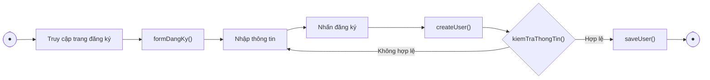

# Sơ đồ hoạt động đăng ký của khách hàng

```mermaid
flowchart LR
    A([●]) --> B[Truy cập trang đăng ký]
    B --> C["formDangKy()"]
    C --> D[Nhập thông tin]
    D --> E[Nhấn đăng ký]
    E --> F["createUser()"]
    F --> G{"kiemTraThongTin()"}
    G -- Không hợp lệ --> D
    G -- Hợp lệ --> H["saveUser()"]
    H --> I([●])
```
