# 3.3 Đặc tả Use Case Chi Tiết

---

## 3.3.1 Use case Quản lý Tài khoản

| | |
|---|---|
| **Tên Use case** | Quản lý Tài khoản |
| **Actor** | Khách hàng |
| **Mô tả** | Khách hàng đăng nhập vào hệ thống bằng email và mật khẩu tài khoản được tạo. Khách hàng đăng nhập vào hệ thống và chọn quản lý tài khoản. Khách hàng có thể xem và cập nhật tài khoản của mình. Khách hàng có thể đặt lại mật khẩu khi đã quên mật khẩu. |
| **Pre-conditions** | Actor chưa đăng nhập vào hệ thống. |
| **Post-conditions** | - Khách hàng đăng nhập vào hệ thống thành công và có thể thực hiện các chức năng của khách hàng. - Extend Use Case Đăng ký - Extend Use Case Đăng nhập - Extend Use Case Cập nhật profile - Extend Use Case Đăng xuất - Extend Use Case Quên mật khẩu |
| **Luồng sự kiện chính** | Actor chọn chức năng Quản lý Tài Khoản. Hệ thống hiển thị màn hình Quản lý Tài Khoản. |
| **Luồng sự kiện phụ** | Actor nhấn đăng xuất, hệ thống trở về trang chủ. |
| **\<\<Extend\>\> Đăng ký** | 1. Khách hàng chọn đăng ký tài khoản. 2. Hệ thống hiển thị trang đăng ký. 3. Khách hàng nhập thông tin đăng ký. 4. Khách hàng nhấn nút đăng ký. 5. Hệ thống kiểm tra thông tin nhập vào hợp lệ. 6. Hệ thống kiểm tra email đã được đăng ký chưa. 7. Lưu tài khoản vào CSDL. Rẽ nhánh 1 — 5.1: Thông tin không hợp lệ, quay lại bước 3. Rẽ nhánh 2 — 6.1: Email đã đăng ký tài khoản, quay lại bước 3. |
| **\<\<Extend\>\> Đăng nhập** | 1. Khách hàng truy cập trang đăng nhập. 2. Hệ thống hiển thị trang đăng nhập. 3. Khách hàng nhập email và mật khẩu. 4. Khách hàng nhấn nút đăng nhập. 5. Hệ thống kiểm tra thông tin đăng nhập. 6. Hệ thống kiểm tra trạng thái tài khoản (is_active). 7. Thông báo đăng nhập thành công và chuyển hướng theo role. Rẽ nhánh 1 — 5.1: Thông tin không hợp lệ, quay lại bước 3. Rẽ nhánh 2 — 6.1: Tài khoản bị vô hiệu hóa, hiển thị thông báo lỗi. |
| **\<\<Extend\>\> Cập nhật profile** | 1. Khách hàng đăng nhập vào hệ thống. 2. Khách hàng vào quản lý tài khoản. 3. Khách hàng chọn chỉnh sửa thông tin. 4. Hệ thống hiển thị form cập nhật, khách hàng nhập thông tin cần thay đổi. 5. Khách hàng nhấn lưu thay đổi. 6. Hệ thống kiểm tra dữ liệu nhập hợp lệ. 7. Hiển thị thông tin tài khoản đã được cập nhật. Rẽ nhánh 1 — 6.1: Thông tin không hợp lệ, quay lại bước 4. |
| **\<\<Extend\>\> Đăng xuất** | 1. Khách hàng nhấn nút Đăng xuất. 2. Hệ thống hủy phiên đăng nhập của khách hàng. 3. Hệ thống chuyển hướng về trang chủ. |
| **\<\<Extend\>\> Quên mật khẩu** | 1. Khách hàng chọn quên mật khẩu. 2. Hệ thống hiển thị trang quên mật khẩu. 3. Khách hàng nhập vào email. 4. Khách hàng nhấn nút tiếp tục. 5. Hệ thống kiểm tra thông tin. 6. Khách hàng nhập mật khẩu mới. 7. Lưu lại thông tin vào CSDL. Rẽ nhánh 1 — 5.1: Thông tin không hợp lệ, quay lại bước 3. |

### PlantUML — Use Case Quản lý Tài khoản

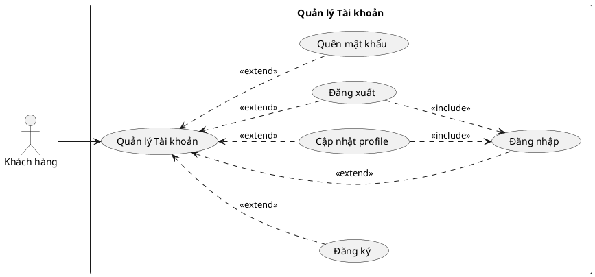

---

## 3.3.2 Use case Quản lý Người dùng

| | |
|---|---|
| **Tên Use case** | Quản lý Người dùng |
| **Actor** | Admin, Giám đốc |
| **Mô tả** | Admin xem danh sách tất cả tài khoản trong hệ thống, có thể tìm kiếm theo email, thay đổi quyền hạn (role) và bật/tắt trạng thái hoạt động của tài khoản. |
| **Pre-conditions** | Actor đã đăng nhập với role admin hoặc director. |
| **Post-conditions** | - Thay đổi role hoặc trạng thái tài khoản được lưu vào CSDL và có hiệu lực ngay. - Extend Use Case Đổi quyền hạn - Extend Use Case Vô hiệu hóa / Kích hoạt tài khoản |
| **Luồng sự kiện chính** | Actor truy cập trang /admin/user. Hệ thống hiển thị danh sách tài khoản có phân trang, hỗ trợ tìm kiếm theo email. |
| **Luồng sự kiện phụ** | Actor không tìm thấy tài khoản, hệ thống hiển thị danh sách rỗng. |
| **\<\<Extend\>\> Đổi quyền hạn** | 1. Admin chọn tài khoản cần đổi quyền. 2. Admin chọn role mới từ danh sách. 3. Admin nhấn lưu. 4. Hệ thống kiểm tra quyền của admin có được phép gán role đó không. 5. Hệ thống lưu role mới vào CSDL. 6. Hệ thống hiển thị thông báo thành công. Rẽ nhánh 1 — 4.1: Admin tự đổi role của mình, hệ thống từ chối. Rẽ nhánh 2 — 4.2: Role không thuộc danh sách được phép, hệ thống từ chối. |
| **\<\<Extend\>\> Vô hiệu hóa / Kích hoạt tài khoản** | 1. Admin chọn tài khoản cần thay đổi trạng thái. 2. Admin nhấn nút toggle trạng thái. 3. Hệ thống kiểm tra quyền của admin. 4. Hệ thống đảo trạng thái is_active của tài khoản. 5. Hệ thống hiển thị thông báo kết quả. Rẽ nhánh 1 — 3.1: Admin cố tắt tài khoản của chính mình, hệ thống từ chối. Rẽ nhánh 2 — 3.2: Tài khoản không thuộc nhóm được phép thay đổi, hệ thống từ chối. |

### PlantUML — Use Case Quản lý Người dùng

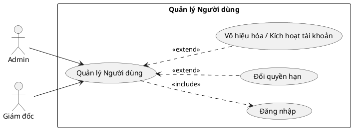

---

## 3.3.3 Use case Quản lý Danh mục

| | |
|---|---|
| **Tên Use case** | Quản lý Danh mục |
| **Actor** | Admin |
| **Mô tả** | Admin quản lý các danh mục sản phẩm trong hệ thống. Admin có thể thêm mới, chỉnh sửa tên và bật/tắt trạng thái hiển thị của danh mục. |
| **Pre-conditions** | Actor đã đăng nhập với role admin. |
| **Post-conditions** | - Thay đổi danh mục được lưu vào CSDL và phản ánh ngay trên giao diện. - Extend Use Case Thêm danh mục -  |
| **Luồng sự kiện chính** | Actor truy cập trang quản lý danh mục. Hệ thống hiển thị danh sách danh mục hiện có kèm trạng thái hiển thị. |
| **Luồng sự kiện phụ** | Không có danh mục nào, hệ thống hiển thị danh sách rỗng. |
| **\<\<Extend\>\> Thêm danh mục** | 1. Admin nhấn nút Thêm mới. 2. Hệ thống hiển thị form nhập thông tin. 3. Admin nhập tên danh mục và chọn trạng thái (hiện/ẩn). 4. Admin nhấn Lưu. 5. Hệ thống kiểm tra dữ liệu hợp lệ. 6. Hệ thống lưu danh mục mới vào CSDL và chuyển về danh sách. Rẽ nhánh 1 — 5.1: Tên bị trống, hiển thị lỗi quay lại bước 3. |
| **\<\<Extend\>\> Sửa danh mục / Bật-tắt trạng thái** | 1. Admin chọn danh mục cần sửa. 2. Hệ thống hiển thị form với tên và trạng thái hiện tại. 3. Admin chỉnh sửa tên và/hoặc thay đổi trạng thái (status: 0=ẩn, 1=hiện). 4. Admin nhấn Lưu. 5. Hệ thống kiểm tra dữ liệu hợp lệ. 6. Hệ thống cập nhật vào CSDL và chuyển về danh sách. Rẽ nhánh 1 — 5.1: Tên bị trống, hiển thị lỗi quay lại bước 3. |

### PlantUML — Use Case Quản lý Danh mục

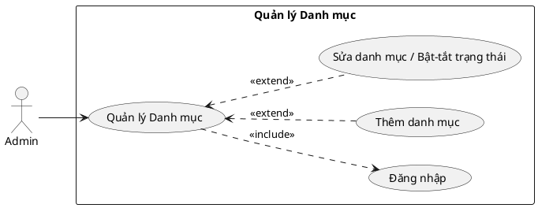

---

## 3.3.4 Use case Giỏ hàng

| | |
|---|---|
| **Tên Use case** | Giỏ hàng |
| **Actor** | Khách hàng |
| **Mô tả** | Khách hàng đã đăng nhập thêm sản phẩm vào giỏ hàng, xem giỏ hàng, cập nhật số lượng và xóa sản phẩm khỏi giỏ. |
| **Pre-conditions** | Actor đã đăng nhập vào hệ thống. |
| **Post-conditions** | - Giỏ hàng được cập nhật đúng theo thao tác. - Extend Use Case Thêm vào giỏ hàng - Extend Use Case Xem giỏ hàng - Extend Use Case Cập nhật số lượng - Extend Use Case Xóa sản phẩm khỏi giỏ |
| **Luồng sự kiện chính** | Actor xem danh sách sản phẩm, chọn sản phẩm và thêm vào giỏ hàng. Hệ thống hiển thị giỏ hàng với tổng tiền. |
| **Luồng sự kiện phụ** | Actor chưa đăng nhập khi thêm giỏ hàng, hệ thống chuyển hướng về trang đăng nhập. |
| **\<\<Extend\>\> Thêm vào giỏ hàng** | 1. Khách hàng chọn sản phẩm và nhấn Thêm vào giỏ. 2. Hệ thống kiểm tra số lượng tồn kho. 3. Hệ thống kiểm tra sản phẩm đã có trong giỏ chưa. 4. Nếu chưa có: tạo mới item trong giỏ. Nếu đã có: tăng số lượng. 5. Hệ thống thông báo thêm thành công. Rẽ nhánh 1 — 2.1: Tồn kho không đủ, hiển thị lỗi. |
| **\<\<Extend\>\> Xem giỏ hàng** | 1. Khách hàng truy cập trang giỏ hàng. 2. Hệ thống hiển thị danh sách sản phẩm đã thêm, số lượng, giá (đã áp dụng khuyến mãi nếu có). 3. Hệ thống hiển thị tổng tiền. |
| **\<\<Extend\>\> Cập nhật số lượng** | 1. Khách hàng nhấn nút tăng/giảm số lượng. 2. Hệ thống kiểm tra tồn kho. 3. Hệ thống cập nhật số lượng qua AJAX. Rẽ nhánh 1 — 2.1: Số lượng vượt tồn kho, không cho tăng thêm. |
| **\<\<Extend\>\> Xóa sản phẩm khỏi giỏ** | 1. Khách hàng nhấn nút xóa sản phẩm. 2. Hệ thống xóa item khỏi giỏ hàng của khách. 3. Hệ thống cập nhật lại giỏ hàng và tổng tiền. |

### PlantUML — Use Case Giỏ hàng

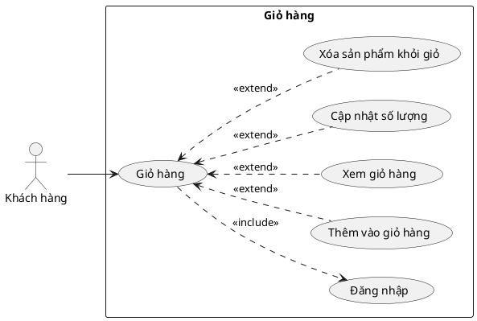

---

## 3.3.5 Use case Đặt hàng

| | |
|---|---|
| **Tên Use case** | Đặt hàng |
| **Actor** | Khách hàng |
| **Mô tả** | Khách hàng chọn sản phẩm trong giỏ để thanh toán, nhập thông tin giao hàng, chọn phương thức thanh toán (COD hoặc chuyển khoản qua PayOS) và xác nhận đặt hàng. |
| **Pre-conditions** | Actor đã đăng nhập và có sản phẩm trong giỏ hàng. |
| **Post-conditions** | - Đơn hàng được tạo trong CSDL, giỏ hàng được xóa. - Extend Use Case Đặt hàng / Thanh toán - Extend Use Case Xem lịch sử đơn hàng - Extend Use Case Hủy đơn hàng - Extend Use Case Yêu cầu hoàn hàng - Extend Use Case Xác nhận nhận hàng |
| **Luồng sự kiện chính** | 1. Khách hàng chọn sản phẩm trong giỏ và nhấn Thanh toán. 2. Hệ thống hiển thị trang nhập thông tin giao hàng. 3. Khách hàng nhập họ tên, địa chỉ, SĐT và chọn phương thức thanh toán. 4. Khách hàng xác nhận đặt hàng. |
| **Luồng sự kiện phụ** | Không chọn sản phẩm nào trong giỏ, hệ thống thông báo lỗi. |
| **\<\<Extend\>\> Đặt hàng / Thanh toán** | 1. Khách hàng chọn sản phẩm trong giỏ và nhấn Thanh toán. 2. Hệ thống hiển thị trang nhập thông tin giao hàng. 3. Khách hàng nhập họ tên, địa chỉ, SĐT và chọn phương thức thanh toán. 4. Khách hàng nhấn Đặt hàng. 5. Hệ thống tạo đơn hàng và xóa sản phẩm khỏi giỏ. Rẽ nhánh 1 — Thanh toán khi nhận hàng (COD): Hệ thống tạo đơn status=1 (đã đặt hàng), gửi email xác nhận kèm link thanh toán online tùy chọn, thông báo đặt hàng thành công. Admin tiếp nhận và xử lý xuất kho. Rẽ nhánh 2 — Chuyển khoản online (PayOS): Hệ thống tạo đơn status=0 (chờ thanh toán), tạo link PayOS và chuyển hướng sang trang QR. Khách quét mã thanh toán → PayOS gọi webhook → hệ thống cập nhật status=1. Nếu khách hủy thanh toán → đơn bị xóa, sản phẩm hoàn về giỏ. |
| **\<\<Extend\>\> Hủy đơn hàng** | 1. Khách hàng vào lịch sử đơn hàng. 2. Khách hàng chọn đơn cần hủy và nhập lý do. 3. Hệ thống kiểm tra đơn có ở trạng thái cho phép hủy không (status=1). 4. Hệ thống cập nhật status=-1. 5. Hệ thống hoàn sản phẩm về giỏ hàng. Rẽ nhánh 1 — 3.1: Đơn đã xuất kho (status≠1), không cho hủy. |
| **\<\<Extend\>\> Yêu cầu hoàn hàng** | 1. Khách hàng vào lịch sử đơn hàng, chọn đơn đã giao (status=4). 2. Khách hàng nhấn Yêu cầu hoàn hàng và nhập lý do. 3. Hệ thống kiểm tra đơn trong vòng 3 ngày kể từ khi giao. 4. Hệ thống cập nhật status=5 (chờ admin xét duyệt hoàn). Rẽ nhánh 1 — 3.1: Quá 3 ngày hoặc đơn không hợp lệ, hệ thống từ chối. |
| **\<\<Extend\>\> Xem lịch sử đơn hàng** | 1. Khách hàng truy cập trang lịch sử đơn hàng. 2. Hệ thống hiển thị danh sách đơn hàng (ẩn các đơn status=0 chưa thanh toán). 3. Khách hàng chọn đơn để xem chi tiết. 4. Hệ thống hiển thị thông tin đơn, danh sách sản phẩm, trạng thái theo timeline. |
| **\<\<Extend\>\> Xác nhận nhận hàng** | 1. Khách hàng quét mã QR trên thùng hàng. 2. Hệ thống hiển thị trang xác nhận thông tin đơn hàng. 3. Khách hàng nhấn xác nhận đã nhận. 4. Hệ thống cập nhật status=4 (Hoàn tất). |

### PlantUML — Use Case Đặt hàng

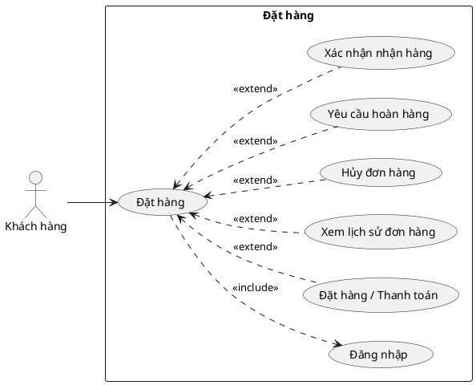

---

## 3.3.6 Use case Quản lý Đơn hàng (Admin)

| | |
|---|---|
| **Tên Use case** | Quản lý Đơn hàng |
| **Actor** | Admin, Nhân viên kho |
| **Mô tả** | Admin và nhân viên kho xem danh sách đơn hàng khách, xử lý các bước từ xác nhận → xuất kho → giao hàng → hoàn tất. Admin còn xử lý yêu cầu hoàn hàng và hàng hỏng. |
| **Pre-conditions** | Actor đã đăng nhập với role admin hoặc warehouse. |
| **Post-conditions** | - Trạng thái đơn hàng được cập nhật vào CSDL. - Extend Use Case Xem danh sách đơn hàng - Extend Use Case Cập nhật trạng thái đơn hàng - Extend Use Case Xử lý hoàn hàng - Extend Use Case Xem hàng hỏng |
| **Luồng sự kiện chính** | Actor truy cập /admin/orders. Hệ thống hiển thị danh sách đơn hàng, hỗ trợ lọc theo trạng thái. |
| **Luồng sự kiện phụ** | Không có đơn nào ở trạng thái cần xử lý, hệ thống hiển thị danh sách rỗng. |
| **\<\<Extend\>\> Xem danh sách đơn hàng** | 1. Actor truy cập trang quản lý đơn hàng. 2. Hệ thống hiển thị danh sách đơn hàng có phân trang và lọc theo trạng thái. 3. Actor chọn đơn để xem chi tiết. |
| **\<\<Extend\>\> Cập nhật trạng thái đơn hàng** | 1. Admin chọn đơn hàng cần xử lý. 2. Admin chọn trạng thái mới (xác nhận / xuất kho / đang giao / hoàn tất / hủy). 3. Hệ thống kiểm tra chuyển trạng thái hợp lệ. 4. Nếu xuất kho: hệ thống trừ tồn kho và ghi nhật ký kho. 5. Hệ thống lưu trạng thái mới. Rẽ nhánh 1 — 3.1: Chuyển trạng thái không hợp lệ, hệ thống từ chối. |
| **\<\<Extend\>\> Xử lý hoàn hàng** | 1. Admin nhận yêu cầu hoàn hàng từ khách (status=5). 2. Admin xem xét lý do hoàn. 3a. Duyệt hoàn: Admin nhấn duyệt → hệ thống cập nhật status=6, cộng lại tồn kho. 3b. Từ chối hoàn: Admin nhập lý do từ chối → hệ thống cập nhật status=4. Rẽ nhánh — 3b: Lý do từ chối rỗng, hệ thống yêu cầu nhập. |
| **\<\<Extend\>\> Xem hàng hỏng** | 1. Admin truy cập trang hàng hỏng. 2. Hệ thống hiển thị danh sách đơn hàng đã được duyệt hoàn (status=6). 3. Admin ghi nhận và xử lý nội bộ. |

### PlantUML — Use Case Quản lý Đơn hàng

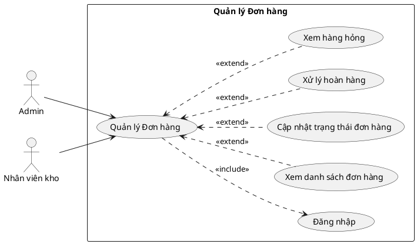

---

## 3.3.7 Use case Quản lý Sản phẩm

| | |
|---|---|
| **Tên Use case** | Quản lý Sản phẩm |
| **Actor** | Admin |
| **Mô tả** | Admin thêm mới, chỉnh sửa thông tin và bật/tắt trạng thái hiển thị sản phẩm. Admin có thể import sản phẩm hàng loạt qua file Excel. |
| **Pre-conditions** | Actor đã đăng nhập với role admin. |
| **Post-conditions** | - Thay đổi sản phẩm được lưu vào CSDL. - Extend Use Case Thêm sản phẩm bằng import file Excel - Extend Use Case Sửa sản phẩm / Ẩn-Hiện sản phẩm |
| **Luồng sự kiện chính** | Actor truy cập trang /admin/product. Hệ thống hiển thị danh sách sản phẩm có tìm kiếm và phân trang. |
| **Luồng sự kiện phụ** | Không có sản phẩm nào, hệ thống hiển thị danh sách rỗng. |
| **\<\<Extend\>\> Thêm sản phẩm bằng import file Excel** | 1. Admin nhấn Import sản phẩm. 2. Hệ thống hiển thị form upload file. 3. Admin chọn file Excel theo đúng mẫu cột (title, price, quantity, category, brand, ...). 4. Hệ thống đọc file và hiển thị preview danh sách sản phẩm. 5. Admin xác nhận import. 6. Hệ thống lưu các sản phẩm hợp lệ vào CSDL. Rẽ nhánh 1 — 3.1: File sai định dạng hoặc thiếu cột bắt buộc, hiển thị lỗi. |
| **\<\<Extend\>\> Sửa sản phẩm / Ẩn-Hiện sản phẩm** | 1. Admin chọn sản phẩm cần sửa. 2. Hệ thống hiển thị form với thông tin hiện tại. 3. Admin chỉnh sửa thông tin và/hoặc thay đổi trạng thái (status: 0=ẩn, 1=hiện). 4. Admin nhấn Lưu. 5. Hệ thống kiểm tra dữ liệu hợp lệ. 6. Hệ thống cập nhật vào CSDL. Rẽ nhánh 1 — 5.1: Dữ liệu không hợp lệ, hiển thị lỗi quay lại bước 3. |

### PlantUML — Use Case Quản lý Sản phẩm

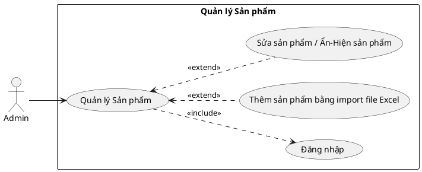

---

## 3.3.8 Use case Quản lý Kho hàng

| | |
|---|---|
| **Tên Use case** | Quản lý Kho hàng |
| **Actor** | Admin, Nhân viên kho |
| **Mô tả** | Nhân viên kho upload file nhập kho, admin duyệt hoặc từ chối. Hệ thống tự động cập nhật tồn kho sau khi admin duyệt. |
| **Pre-conditions** | Actor đã đăng nhập với role admin hoặc warehouse. |
| **Post-conditions** | - Tồn kho được cập nhật sau khi duyệt nhập kho. - Extend Use Case Upload file nhập kho - Extend Use Case Duyệt nhập kho - Extend Use Case Từ chối nhập kho - Extend Use Case Xem tồn kho |
| **Luồng sự kiện chính** | Actor truy cập trang kho hàng. Hệ thống hiển thị danh sách tồn kho và lịch sử nhập/xuất. |
| **Luồng sự kiện phụ** | File nhập kho sai định dạng, hệ thống hiển thị lỗi. |
| **\<\<Extend\>\> Upload file nhập kho** | 1. Nhân viên kho nhấn Upload file nhập kho. 2. Hệ thống hiển thị form upload. 3. Nhân viên chọn file Excel và điền thông tin nhà cung cấp. 4. Hệ thống đọc file và lưu với status=pending. 5. Hệ thống hiển thị thông báo chờ admin duyệt. Rẽ nhánh 1 — 3.1: File sai định dạng, hiển thị lỗi. |
| **\<\<Extend\>\> Duyệt nhập kho** | 1. Admin xem danh sách file nhập kho chờ duyệt. 2. Admin mở file xem chi tiết từng sản phẩm. 3. Admin tick chọn sản phẩm cần nhập và điền số lượng. 4. Admin nhấn Duyệt. 5. Hệ thống cập nhật tồn kho, tạo phiếu nhập và ghi nhật ký kho. |
| **\<\<Extend\>\> Từ chối nhập kho** | 1. Admin mở file nhập kho chờ duyệt. 2. Admin nhấn Từ chối và nhập lý do. 3. Hệ thống cập nhật status=rejected. Rẽ nhánh 1 — 2.1: Lý do rỗng, hệ thống yêu cầu nhập lý do. |
| **\<\<Extend\>\> Xem tồn kho** | 1. Actor truy cập trang xem tồn kho. 2. Hệ thống hiển thị danh sách sản phẩm kèm số lượng tồn kho hiện tại. 3. Actor có thể xem lịch sử biến động tồn kho theo từng sản phẩm. |

### PlantUML — Use Case Quản lý Kho hàng

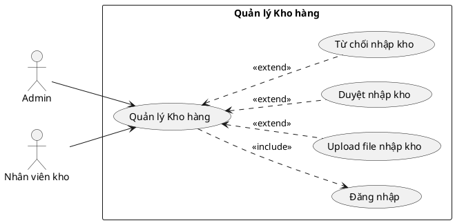

---

## 3.3.9 Use case Báo giá Nhà sản xuất

| | |
|---|---|
| **Tên Use case** | Báo giá Nhà sản xuất |
| **Actor** | Nhà sản xuất, Admin |
| **Mô tả** | Nhà sản xuất upload file báo giá (Excel/CSV) lên hệ thống. Admin xem danh sách báo giá, chọn sản phẩm cần đặt và tạo đơn đặt hàng. |
| **Pre-conditions** | Actor đã đăng nhập với role tương ứng (manufacturer hoặc admin). |
| **Post-conditions** | - Báo giá được lưu vào CSDL. Admin có thể tạo đơn đặt hàng hoặc từ chối báo giá. - Extend Use Case Upload file báo giá - Extend Use Case Xem chi tiết báo giá - Extend Use Case Từ chối báo giá - Extend Use Case Tạo đơn đặt hàng từ báo giá |
| **Luồng sự kiện chính** | NSX truy cập trang /admin/supplier-offers và upload file. Admin vào trang để xem danh sách báo giá và xử lý. |
| **Luồng sự kiện phụ** | File báo giá sai định dạng, hệ thống hiển thị lỗi. |
| **\<\<Extend\>\> Upload file báo giá** | 1. Nhà sản xuất đăng nhập và truy cập trang báo giá. 2. NSX chọn file Excel/CSV chứa danh sách sản phẩm và đơn giá. 3. NSX nhấn Upload. 4. Hệ thống đọc file, tạo SupplierOffer + các dòng sản phẩm liên kết với tài khoản NSX. 5. Hệ thống hiển thị thông báo upload thành công. Rẽ nhánh 1 — 4.1: File rỗng hoặc sai định dạng, hiển thị lỗi. |
| **\<\<Extend\>\> Xem chi tiết báo giá** | 1. Admin chọn báo giá cần xem. 2. Hệ thống hiển thị danh sách sản phẩm, đơn giá, nhà sản xuất. 3. Admin tick chọn sản phẩm và điền số lượng để đặt hàng. |
| **\<\<Extend\>\> Từ chối báo giá** | 1. Admin xem chi tiết báo giá không phù hợp. 2. Admin nhấn Từ chối báo giá. 3. Hệ thống cập nhật status=rejected. 4. Hệ thống chuyển về danh sách báo giá. |
| **\<\<Extend\>\> Tạo đơn đặt hàng từ báo giá** | 1. Admin xem chi tiết báo giá, tick sản phẩm và điền số lượng cần đặt. 2. Admin nhấn Đặt hàng. 3. Hệ thống tạo PurchaseOrder và các dòng chi tiết từ báo giá được chọn. 4. Hệ thống cập nhật báo giá đó status=accepted. 5. Nếu báo giá này thuộc một yêu cầu nhập hàng, hệ thống tự động đóng yêu cầu đó lại (status=closed). 6. Hệ thống redirect sang trang danh sách đơn đặt hàng. |

### PlantUML — Use Case Báo giá Nhà sản xuất

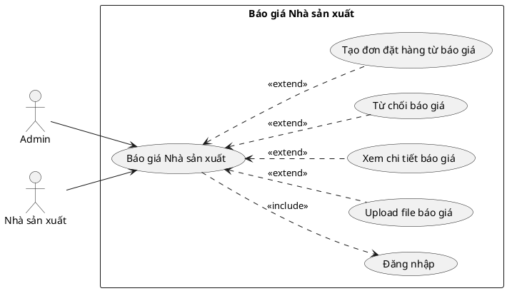

---

## 3.3.10 Use case Yêu cầu nhập hàng

| | |
|---|---|
| **Tên Use case** | Yêu cầu nhập hàng |
| **Actor** | Admin, Nhà sản xuất |
| **Mô tả** | Admin tạo yêu cầu nhập hàng công khai từ danh sách sản phẩm sắp hết. Nhà sản xuất xem yêu cầu và upload file báo giá đáp lại. Admin xem và so sánh các báo giá nhận được. |
| **Pre-conditions** | Actor đã đăng nhập với role admin hoặc manufacturer. |
| **Post-conditions** | - Yêu cầu được tạo, NSX có thể gửi báo giá. Admin có thể đóng yêu cầu và tạo đơn đặt hàng. - Extend Use Case Tạo yêu cầu nhập hàng - Extend Use Case Xem yêu cầu và gửi báo giá - Extend Use Case Đóng yêu cầu |
| **Luồng sự kiện chính** | Admin truy cập /admin/procurement. Hệ thống hiển thị danh sách yêu cầu thu mua. |
| **Luồng sự kiện phụ** | Không có sản phẩm sắp hết hàng, modal hiển thị danh sách rỗng. |
| **\<\<Extend\>\> Tạo yêu cầu nhập hàng** | 1. Admin vào trang sản phẩm và nhấn Đăng yêu cầu nhập hàng. 2. Hệ thống hiển thị modal danh sách SP tồn kho thấp. 3. Admin tick SP cần nhập và điền số lượng. 4. Admin điền hạn chót và nhấn Đăng yêu cầu. 5. Hệ thống tạo ProcurementRequest (status=open) và các dòng sản phẩm. 6. Hệ thống redirect sang trang chi tiết yêu cầu. Rẽ nhánh 1 — 3.1: Không chọn sản phẩm nào, hệ thống hiển thị lỗi. |
| **\<\<Extend\>\> Xem yêu cầu và gửi báo giá** | 1. Nhà sản xuất truy cập trang yêu cầu nhập hàng. 2. Hệ thống hiển thị danh sách yêu cầu đang mở (status=open). 3. NSX chọn yêu cầu và tải file mẫu báo giá. 4. NSX điền giá vào file mẫu và upload lên. 5. Hệ thống tạo SupplierOffer liên kết với yêu cầu. Rẽ nhánh 1 — 4.1: File sai định dạng hoặc thiếu dữ liệu, hiển thị lỗi. |
| **\<\<Extend\>\> Đóng yêu cầu** | 1. Admin nhấn Đóng yêu cầu. 2. Hệ thống xác nhận đóng. 3. Hệ thống cập nhật status=closed. 4. NSX không thể upload báo giá cho yêu cầu này nữa. |

### PlantUML — Use Case Yêu cầu nhập hàng

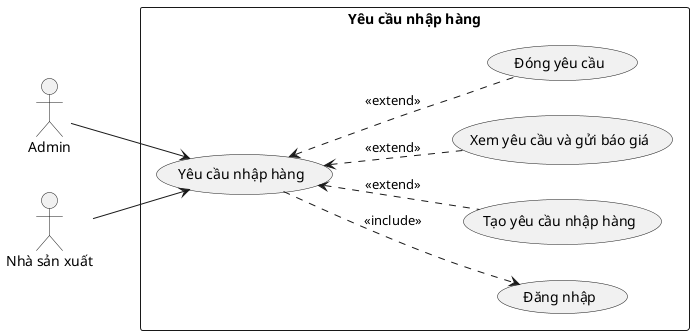

---

## 3.3.11 Use case Quản lý Đơn đặt hàng NSX

| | |
|---|---|
| **Tên Use case** | Quản lý Đơn đặt hàng NSX |
| **Actor** | Admin, Nhân viên kho, Nhà sản xuất |
| **Mô tả** | Admin tạo đơn đặt hàng từ báo giá được chọn. Nhà sản xuất xác nhận đơn và giao hàng. Nhân viên kho nhận hàng và cập nhật tồn kho. |
| **Pre-conditions** | Actor đã đăng nhập với role tương ứng. Đã có báo giá được chấp nhận. |
| **Post-conditions** | - Đơn đặt hàng được theo dõi qua các bước. Tồn kho được cập nhật khi nhận hàng. - Extend Use Case Xem chi tiết đơn đặt hàng - Extend Use Case Cập nhật trạng thái đơn - Extend Use Case Xác nhận đã nhận hàng |
| **Luồng sự kiện chính** | Actor truy cập /admin/purchase-orders. Hệ thống hiển thị danh sách đơn đặt hàng. |
| **Luồng sự kiện phụ** | Chưa có đơn đặt hàng nào, hệ thống hiển thị danh sách rỗng. |
| **\<\<Extend\>\> Xem chi tiết đơn đặt hàng** | 1. Actor chọn đơn đặt hàng cần xem. 2. Hệ thống hiển thị thông tin đơn, danh sách sản phẩm, trạng thái hiện tại. 3. Nhà sản xuất xem thông tin và chuẩn bị hàng. |
| **\<\<Extend\>\> Cập nhật trạng thái đơn** | 1. Admin hoặc NSX chọn trạng thái mới phù hợp với vai trò. 2. Hệ thống kiểm tra quyền và tính hợp lệ của chuyển trạng thái. 3. Hệ thống lưu trạng thái mới. Rẽ nhánh 1 — 2.1: Không có quyền chuyển trạng thái này, hệ thống từ chối. |
| **\<\<Extend\>\> Xác nhận đã nhận hàng** | 1. Nhân viên kho mở đơn đặt hàng đang giao. 2. Nhân viên kho nhấn Đã nhận hàng. 3. Hệ thống cập nhật status=received. 4. Hệ thống cộng số lượng vào tồn kho và ghi nhật ký kho. |

### PlantUML — Use Case Quản lý Đơn đặt hàng NSX

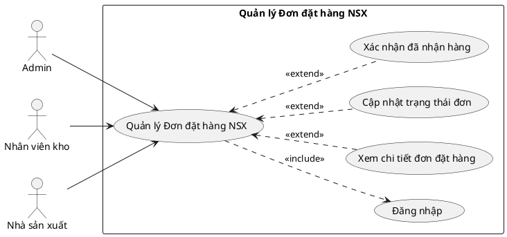
